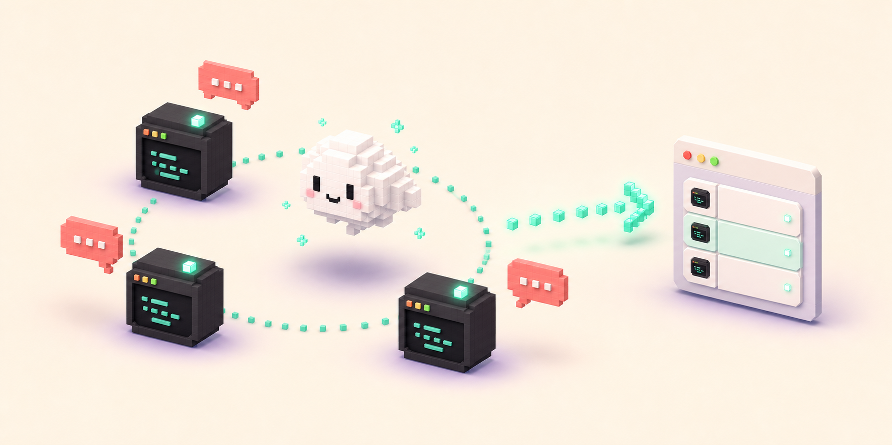

<div align="center">


# ClaudePet

### A tiny macOS desk companion for Claude Code sessions.

`Swift` | `macOS 14+` | `Claude Code` | `menu bar` | `floating overlay`

</div>

ClaudePet keeps a small, friendly watch over local Claude Code sessions. It floats above your desktop, shows live sessions as pet-side bubbles, and helps you jump back to the right host app without hunting through windows.

## What Makes It Cute and Useful

| Tiny job | What it does |
| --- | --- |
| Watches the session pile | Reads local Claude session metadata and keeps the overlay fresh. |
| Floats out of the way | Uses a transparent accessory window that can live across Spaces. |
| Points you back | Lets you click a session bubble to activate the matching host app. |
| Keeps the desk tidy | Hides Claude sessions whose processes are no longer running. |
| Stays local | Uses local files and live process IDs; no cloud service is involved. |

## The Little Loop

<div align="center">



</div>

1. ClaudePet scans local Claude session records.
2. It filters out stale sessions by checking live process IDs.
3. Waiting, busy, and completed sessions appear in the overlay.
4. A click on a session bubble brings the owning app forward.

## What It Reads

ClaudePet reads:

```text
~/.claude/sessions/*.json
~/.claude/projects/<project>/<session>.jsonl
```

It uses session metadata such as PID, working directory, entrypoint, kind, status, and timestamps. It also uses local transcript entries for readable titles, previews, and dismissal tokens. It does not need a hosted service to work.

## Session Activation

Click a visible session bubble to jump back to that Claude session.

ClaudePet currently knows how to activate sessions hosted by:

| Host app | Supported |
| --- | --- |
| Terminal.app | Yes |
| Ghostty | Yes |
| Visual Studio Code | Yes |
| Visual Studio Code Insiders | Yes |
| cmux | Yes |

When ClaudePet can identify the owning app but cannot identify the exact tab or window, it still brings that app forward. Exact tab or window focusing may require macOS Accessibility or Automation permission. If Accessibility permission is missing, ClaudePet asks macOS to show the permission prompt and shows an error bubble until access is granted.

## Run It

```bash
./scripts/run_app.sh
```

## Check It

```bash
./scripts/check.sh
```

## Tiny Details

- ClaudePet is an accessory app, so it does not show in the Dock.
- The overlay starts near the bottom-right of the main screen.
- Session state refreshes every two seconds.
- Claude sessions with dead PIDs are hidden.
- The README artwork is generated for this repository and stored in `docs/assets/`.
