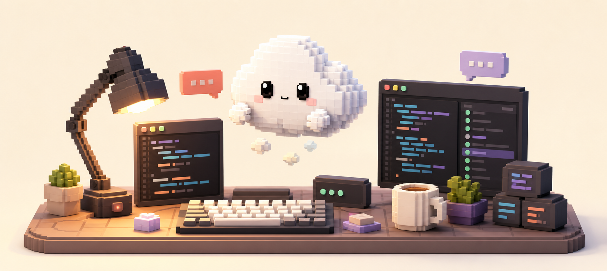
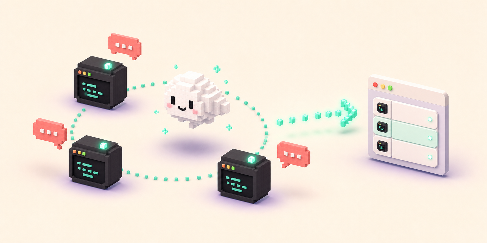

<div align="center">



# Pets

### A tiny macOS desk companion for local AI work.

`Swift` | `macOS 14+` | `local AI tools` | `desktop pets` | `floating overlay`

</div>

Pets keeps a small, friendly watch over local AI sessions and applications. It floats above your desktop, shows activity as pet-side bubbles, and helps you jump back to the right host app without hunting through windows.

## What Makes It Cute and Useful

| Tiny job | What it does |
| --- | --- |
| Watches the session pile | Reads local session metadata and application activity, then keeps the overlay fresh. |
| Floats out of the way | Uses a transparent accessory window that can live across Spaces. |
| Points you back | Lets you click a session bubble to activate the matching host app. |
| Keeps the desk tidy | Hides Claude sessions whose processes are no longer running. |
| Stays local | Uses local files and live process IDs; no cloud service is involved. |

## The Little Loop

<div align="center">



</div>

1. Pets scans supported local session records, applications, and CLI processes.
2. It filters out stale records and background-only helpers.
3. Waiting, busy, idle, and application sessions appear in the overlay.
4. A click on an application bubble brings the exact running app forward.

## Trackers

Claude Code, Codex, and GitHub Copilot have transcript-aware adapters that can show chat status and readable session details.

Pets also tracks real local app and CLI activity for Cursor, Ollama, Gemini, Antigravity, Hermes, T3 Code, Open Design, Kiro, Zed, Windsurf, opencode, pi, NotebookLM, LM Studio, and Stitch. NotebookLM and Stitch are detected when their installed web apps are running. Ollama's always-on `ollama serve` helper is ignored; an interactive `ollama run` command or active Ollama window is tracked instead.

These additional activity trackers do not claim account quota or token totals and do not contribute to Collection key progress. They report only activity visible on this Mac.

## What It Reads

For detailed Claude sessions, Pets reads:

```text
~/.claude/sessions/*.json
~/.claude/projects/<project>/<session>.jsonl
```

It uses session metadata such as PID, working directory, entrypoint, kind, status, and timestamps. It also uses local transcript entries for readable titles, previews, and dismissal tokens. It does not need a hosted service to work.

## Session Activation

Click a visible session bubble to jump back to that Claude session.

Pets currently knows how to activate sessions hosted by:

| Host app | Supported |
| --- | --- |
| Terminal.app | Yes |
| Ghostty | Yes |
| Visual Studio Code | Yes |
| Visual Studio Code Insiders | Yes |
| cmux | Yes |

When Pets can identify the owning app but cannot identify the exact tab or window, it still brings that app forward. Exact tab or window focusing may require macOS Accessibility or Automation permission. If Accessibility permission is missing, Pets asks macOS to show the permission prompt and shows an error bubble until access is granted.

## Install It

Download the newest `Pets-<version>.zip` from the [latest GitHub release](https://github.com/adriandarian/pets/releases/latest), open it, and move `Pets.app` to Applications.

Pets is signed with the maintainer's Apple Development certificate, but it is not Developer ID signed or notarized. On first launch, Control-click `Pets.app`, choose **Open**, and confirm that you want to run it.

## Update It

Pets checks this repository for a newer release when it starts and every six hours while it is running. Right-click any visible pet to hide it, check for updates, open an available GitHub download, or open the configuration window.

The first launch of every release also adds an update gift to the Collection. Routine releases grant 1 Common Key by default. Add the exact version to `RELEASE_GIFT_OVERRIDES` with `major` for 2 Common Keys or `anniversary` for 1 Rare Key. Release gifts never contain Legendary Keys, and each version can be claimed only once.

Hide every visible pet to close Pets, download the new ZIP, and replace the existing `Pets.app`. Launch the installed app again to bring your pets back. Your configured pets, positions, preferences, keys, and collection progress stay in `~/Library/Preferences/local.pets.Pets.plist`; replacing the application does not remove them.

## Run It From Source

```bash
./scripts/run_app.sh
```

To create the signed ZIP used for a GitHub release, update `VERSION` and `BUILD_NUMBER`, add a version-specific gift override only when needed, then run:

```bash
./scripts/build_release.sh
```

After committing the version change, publish that ZIP and its GitHub release with:

```bash
./scripts/publish_release.sh
```

## Check It

```bash
./scripts/check.sh
```

## Tiny Details

- Pets is an accessory app, so it does not show in the Dock.
- Right-click a pet for its controls; Pets does not add a menu-bar item.
- The overlay starts near the bottom-right of the main screen.
- Session state refreshes every five seconds.
- Claude sessions with dead PIDs are hidden.
- The README artwork is generated for this repository and stored in `docs/assets/`.
