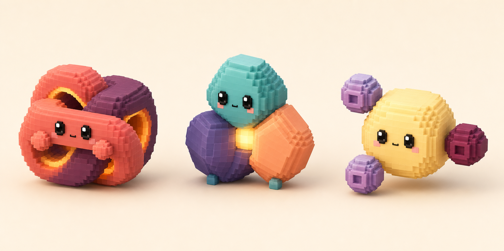

# Tesslings Pet Family Design

**Date:** 2026-07-17

**Status:** Approved

## Summary

Pets will add **Tesslings**, a three-pet family of living voxel arrangements. The family is intentionally small: each member has a different construction and animation grammar, so none reads as the same pet with a different palette.

The approved concept contains:

- **Knotling**, a continuous living voxel ribbon that folds and threads through itself.
- **Prismite**, an asymmetrical group of interlocking voxel pods held together by a luminous core.
- **Orbitling**, a central voxel body accompanied by detached motes that orbit, dock, and scatter.

The family shares soft rounded voxel construction, glossy square eyes, a tiny mouth, restrained blush, warm studio lighting, and visible golden life energy. Family resemblance comes from material and reconfiguration behavior rather than a repeated silhouette.



## Goals

- Add a `Tesslings` category after `Cloud Pets`.
- Add exactly three built-in pets: Knotling, Prismite, and Orbitling.
- Give every pet a distinct silhouette and transformation system.
- Support idle, busy, waiting, excited, and sleeping artwork through the existing `PetArtPack` renderer.
- Preserve the existing overlay, settings, collection, persistence, and chest-opening flows.
- Package production-ready 512x512 transparent PNG frames in `PetsCore`.
- Keep completion and error reactions in the existing shared runtime effects.
- Verify catalog registration, rarity, animation resources, alpha quality, anchor stability, and overlay bounds.

## Non-Goals

- Additional Tessling pets in the initial release.
- Color-only or complexity-only variants of the three approved pets.
- User-selectable Tessling colors.
- A general layered-animation engine or pet editor.
- New settings controls or a persistence schema migration.
- Tessling-specific completion or error artwork.
- Ambient weather or particle effects.

## Family Identity

Tesslings are stable arrangements of living voxel material. They can loosen, separate, orbit, and reassemble, but each pet always returns to its defining construction.

The three pets share:

- Small, softly beveled voxel units with a restrained matte-satin finish.
- A near-isometric three-quarter camera angle.
- Large glossy square eyes, one tiny mouth, and subtle blush.
- A warm golden energy element that visibly powers reconfiguration.
- Readable silhouettes at 64 points.
- No clothing, props, familiar animal anatomy, plants, mushrooms, robots, clouds, or weather motifs.

The three pets must not share:

- The same outer silhouette.
- The same number or arrangement of body components.
- A transformation animation with only palette changes.

## Roster and Progression

| Pet | ID | Rarity | Construction | Golden energy |
| --- | --- | --- | --- | --- |
| Knotling | `knotling` | Common | One continuous ribbon with bold negative-space openings | Illuminated inner seam |
| Prismite | `prismite` | Rare | Three asymmetrical interlocking pods | Central square core |
| Orbitling | `orbitling` | Legendary | One central body with three detached motes | Illuminated mote centers |

The common, rare, and legendary assignments use the existing one-, two-, and four-key chest costs. Cumulus remains the default and always-owned pet. Tesslings enter the normal collection pool and are not grandfathered into existing collections.

## Animation Language

Every persistent visual state uses a looping animation. A Tessling may change posture and component arrangement, but it must return to its canonical identity before the loop closes.

| State | Knotling | Prismite | Orbitling |
| --- | --- | --- | --- |
| Idle | One crossing slowly threads over and under | Pods gently separate and reseat | Motes follow an uneven, relaxed orbit |
| Busy | Ribbon cycles faster and tightens | Pods rotate and reorder around the bright core | Motes form a fast, compact circuit |
| Waiting | Knot loosens into a wider attentive opening | Face pod leans forward while the others steady it | Motes pause in an ellipsis-like formation |
| Excited | Ribbon unfurls into tall loops and snaps back | Pods pop outward and reassemble playfully | Motes scatter upward and spiral home |
| Sleeping | Body coils into a compact knot and the seam dims | Pods close protectively around the core | Motes dock into the body and leave one faint pulse |

Completion and error remain runtime reactions layered over the resolved animation. They do not add Tessling-specific frame directories.

## Animation Asset Scope

Each pet ships with:

- Eight idle frames.
- Four busy frames.
- Four waiting frames.
- Five excited frames.
- Four sleeping frames.

All five states use `PetAnimationLoopBehavior.loop`. Frame durations and blend durations live in the pet definition helper so the resource folders contain only numbered PNGs.

The art layout is:

```text
Sources/PetsCore/Resources/PetArt/
├── knotling/
│   ├── idle/frame-000.png ... frame-007.png
│   ├── busy/frame-000.png ... frame-003.png
│   ├── waiting/frame-000.png ... frame-003.png
│   ├── excited/frame-000.png ... frame-004.png
│   └── sleeping/frame-000.png ... frame-003.png
├── prismite/
│   ├── idle/frame-000.png ... frame-007.png
│   ├── busy/frame-000.png ... frame-003.png
│   ├── waiting/frame-000.png ... frame-003.png
│   ├── excited/frame-000.png ... frame-004.png
│   └── sleeping/frame-000.png ... frame-003.png
└── orbitling/
    ├── idle/frame-000.png ... frame-007.png
    ├── busy/frame-000.png ... frame-003.png
    ├── waiting/frame-000.png ... frame-003.png
    ├── excited/frame-000.png ... frame-004.png
    └── sleeping/frame-000.png ... frame-003.png
```

Production frames must:

- Be 512x512 RGBA PNGs.
- Have fully transparent corners.
- Use the same camera, lighting direction, material finish, face construction, and canvas origin within one pet.
- Keep the substantive alpha bounds centered within eight pixels of that pet's canonical idle frame.
- Contain no background, floor, text, watermark, baked cast shadow, or glow outside the character.
- Preserve detached Orbitling motes as substantive alpha features rather than pruning them as specks.

## Art Generation Workflow

The built-in image-generation path will use the approved concept as the family reference.

For each pet:

1. Generate and validate a canonical idle pose on a perfectly flat chroma-key background.
2. Use the canonical pose as the identity reference for one contact sheet per visual state.
3. Keep frame panels on a fixed grid with consistent scale, camera, light, and floor anchor.
4. Split the contact sheet into individual source frames.
5. Remove the chroma key with the installed image-generation helper using soft matte and despill.
6. Normalize each accepted result to a 512x512 transparent canvas without changing relative subject scale.
7. Validate alpha, corners, component count, face identity, anchor drift, and edge contamination.
8. Build contact sheets from the normalized production assets for final motion inspection.

If chroma-key removal damages a silhouette, that frame is regenerated or reprocessed. The implementation will not silently switch to a different image model or true-transparency CLI path.

## Code Integration

### Catalog and definitions

`PetID` gains three additive IDs:

```swift
public static let knotling = PetID(rawValue: "knotling")
public static let prismite = PetID(rawValue: "prismite")
public static let orbitling = PetID(rawValue: "orbitling")
```

`PetCategoryDescriptor` gains `tesslings` with category order `1`, immediately after Cloud Pets.

`TesslingPetDefinitions.swift` owns `KnotlingPetDefinition`, `PrismitePetDefinition`, and `OrbitlingPetDefinition`, plus private helpers that construct their state animations. Each definition uses:

- `.assetPack` rendering.
- `.chunky` as the maximum pixelation setting.
- Status moods and hover excitement enabled.
- `.standard` instance defaults.
- No ambient effect.
- An individual `PetPresentationConfiguration` for scale, anchor, shadow, and transition tuning.

`PetCatalog.definitions` appends the three definitions after the five cloud definitions. `builtInCategories`, display names, rarity filtering, collection browsing, and renderer resolution continue deriving from registered definitions.

### Rendering and persistence

The current `AssetPetSprite` and `PetLayerRenderView` already resolve `PetArtPack` state, frame playback, crossfades, motion presets, and runtime reactions. Tesslings use that path without a new render-source case.

`PetInstance` continues persisting a `PetID` raw value. The IDs are additive, so no schema migration is required. Unknown or removed IDs continue resolving to Cumulus through the current catalog fallback.

## Error Handling

- A missing optional state continues falling back directly to idle through `PetArtPack.resolvedAnimation(for:)` during development.
- Production tests require all five Tessling states, so a missing Tessling resource fails the suite before release.
- Missing runtime art continues showing the existing placeholder rather than crashing the app.
- Alpha, dimensions, and transparent-corner violations fail resource tests.
- Excessive frame-to-frame anchor or size drift fails the Tessling art tests.
- Orbitling frames fail validation when a detached mote is clipped by the 512x512 canvas.

## Verification

Automated tests will verify:

- `Tesslings` follows `Cloud Pets` in catalog order.
- The category contains Knotling, Prismite, and Orbitling in that order.
- Display names, rarities, maximum pixelation, and collection eligibility are correct.
- Every definition uses an asset pack with the exact required state frame counts.
- Every frame resolves from `Bundle.module`, is 512x512, has alpha, and has transparent corners.
- Idle and state frames remain aligned to each pet's canonical bounds.
- Orbitling's detached motes remain inside the canvas and count toward substantive alpha bounds.
- The existing visual-state resolver selects all five persistent states.
- The existing completion and error reactions remain runtime effects.

Manual verification will cover:

- The family appears in the collection browser after Cloud Pets.
- Locked and owned Tesslings follow existing chest and picker behavior.
- Every pet renders in collection cards, settings previews, and the desktop overlay.
- Busy, waiting, excited, sleeping, completion, and error transitions remain legible.
- Pixelation settings up to Chunky render cleanly.
- Knotling openings remain visible, Prismite pods do not merge visually, and Orbitling motes do not clip.
- Multiple visible Tesslings animate with independent phase offsets and acceptable CPU usage.

The final repository gate is `./scripts/check.sh`, followed by `./scripts/run_app.sh --verify` for the packaged app.
