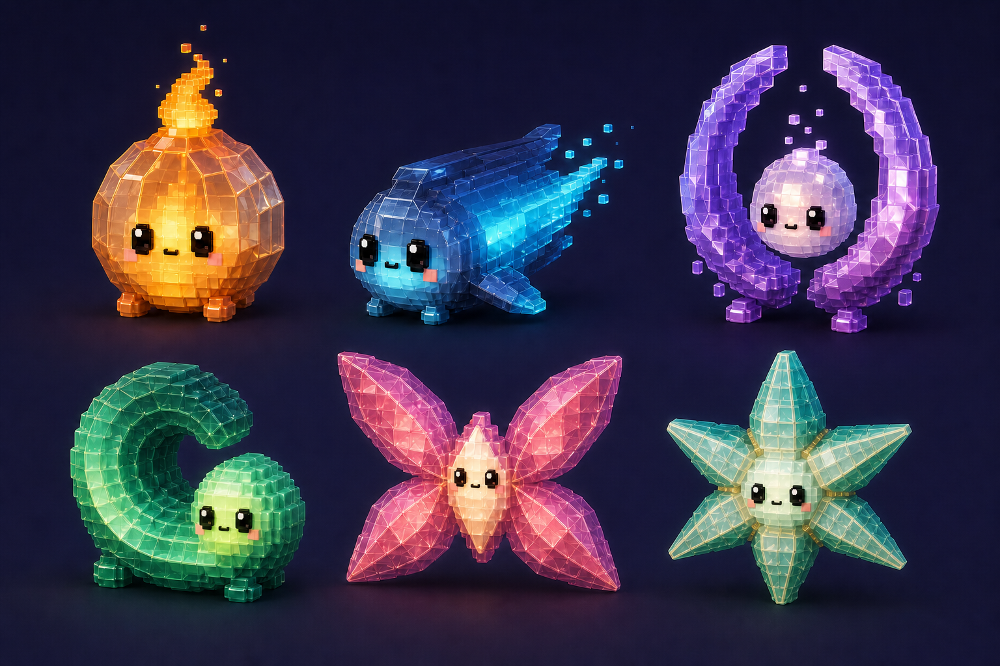
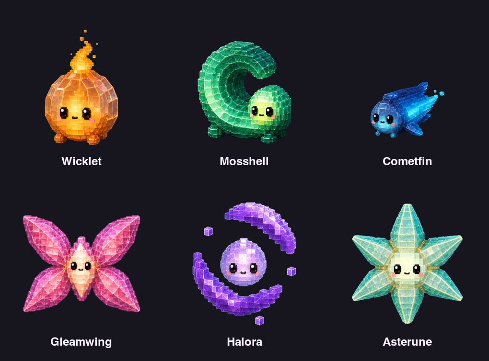

# Glowkin Pet Family Design

**Date:** 2026-07-19

**Status:** Approved and implemented; production art, catalog integration, tests, and packaged-app verification complete

## Summary

Pets will add **Glowkin**, a six-pet family of small beings whose visible life core illuminates a translucent mineral shell. The approved starting concept establishes the first three members: an amber lantern creature, a cyan comet-fish, and a violet halo/core guardian.

The launch roster expands that trio with an emerald spiral-shell creature, a rose kite-moth, and a pearl/mint star-cage. The result is a balanced two-common, two-rare, two-legendary family whose members remain distinguishable by silhouette before color, face, particles, or animation are considered.

Approved starting concept:

`/Users/dariana/.codex/generated_images/019f7ca7-be7b-7542-ac17-7d421be25972/exec-a4483179-41ed-4f4d-9c36-fc1db76c9f1b.png`

Approved-roster concept sheet:



Implemented production roster:



Existing product references:

- `docs/assets/cloud-family-concept.png`
- `docs/assets/tesslings-family-concept.png`
- Production art under `Sources/PetsCore/Resources/PetArt/`

## Source-Grounded Product Constraints

The current app shapes this design in several important ways:

- Every registered pet is a `PetDefinition` backed by a `PetArtPack`.
- The supported visual states are idle, busy, waiting, excited, sleeping, completion, and error.
- Optional state art falls back to idle, while idle motion can freeze playback on `frame-000.png`.
- The live desktop pet is rendered at approximately 95 points (`132 x 0.72`), but the same art appears at 34 and 42 points in settings rows, 78 points in collection cards, 116 points in the settings preview, and 150 points in the unlock sheet.
- Production frames are 512x512 RGBA PNGs with fully transparent corners and no baked floor or cast shadow.
- The steady animation path runs at 12 Hz; completion and error reactions switch to the shared SwiftUI reaction path.
- Existing whole-pet motion presets are `.breathe`, `.bob`, `.sway`, and `.pulse`.
- The current runtime ambient vocabulary is cloud-specific (`storm`, `wind`, and `snow`), so Glowkin should not borrow it merely to add movement.
- Completion uses the requested completion animation when supplied and otherwise falls back to idle beneath the shared warm screen treatment. Error freezes the resolved animation at its canonical first frame, then darkens, desaturates, and lowers the pet.
- The unlock sheet now derives its family label from the catalog category, so Glowkin unlocks are presented as Glowkin rather than Cloud Pets.

These constraints favor strong canonical frames, compact loops, stable alpha bounds, and restrained light effects that remain readable on arbitrary desktops.

## Family Identity

Glowkin are living light protected by grown mineral shells. Their shell is not clothing, armor, or a vehicle: it refracts their core and responds to its emotional pressure.

Every Glowkin shares:

- One clearly visible luminous core or internal light chamber.
- A faceted, voxel-built mineral shell with hard refraction seams rather than the matte rounded blocks used by Tesslings.
- One darker saturated outer rim that keeps the silhouette visible over light wallpapers.
- Glossy black rectangular eyes, a tiny mouth, and restrained blush consistent with the existing Pets face language.
- A near-isometric three-quarter camera, warm key light, and a fixed floor anchor inside a transparent 512x512 canvas.
- A shell-first silhouette: the pet remains identifiable when rendered in grayscale with its glow and detached motes removed.
- Motion in which the core leads and the shell responds 80-140 ms later, making the light feel alive inside a heavier material.

Glowkin must not share:

- The same outer contour with only different colors or appendages.
- A generic round body as the base for every member.
- Tessling-style component reassembly as their primary animation language.
- Cloud/weather motifs, clothing, tools, or familiar household props beyond the abstract lantern read of Wicklet.
- Large halos of soft bloom that erase the voxel contour.

## Launch Roster

| Pet | Proposed ID | Rarity | Canonical silhouette | Personality | Palette and material |
| --- | --- | --- | --- | --- | --- |
| **Wicklet** | `wicklet` | Common | Squat octagonal lantern body, two block feet, and one tall tapered flame plume | Earnest, reassuring, and a little overprepared | Burnt amber rim (`#B85A18`), honey glass (`#F59A24`), lemon-white core (`#FFE66A`), coral blush |
| **Mosshell** | `mosshell` | Common | Low asymmetrical C-shaped spiral shell with a large central cutout and a small core-face peeking from one side | Shy, patient, and quietly observant | Deep emerald rim (`#08745E`), jade glass (`#31C98B`), chartreuse core (`#DFFF72`), cool mint highlights |
| **Cometfin** | `cometfin` | Rare | Long horizontal wedge with a rounded head, high dorsal keel, forked crystal tail, and two small fins | Alert, quick, and eager to move first | Midnight cobalt shell (`#173E78`), electric cyan seams (`#18D8F2`), ice-blue core (`#BDF8FF`), soft rose blush |
| **Gleamwing** | `gleamwing` | Rare | Wide diamond/X made from four broad kite-like wings around a narrow vertical core body | Social, theatrical, and delighted by attention | Mulberry rim (`#8E356D`), rose glass (`#D84E8C`), apricot refraction (`#FF9A74`), warm-white core |
| **Halora** | `halora` | Legendary | Two tall open violet arcs framing a floating round core, with strong negative space above and below | Gentle, protective, and intensely focused | Amethyst rim (`#7042B8`), lilac glass (`#B68BFF`), pearl-pink core (`#FFF0FF`), three lavender motes |
| **Asterune** | `asterune` | Legendary | Six chunky tapered rays forming a stellated cage around a compact core; no circular outer boundary | Precise, curious, and fascinated by patterns | Deep sea-glass rim (`#378E7F`), opaline panes (`#D8F4EE`), pale-gold seams (`#FFE39A`), white-green core (`#F5FFD0`) |

### Roster rationale

The two-per-tier split is deliberate:

- Common introduces the material language through one symmetrical warm pet and one asymmetrical cool pet.
- Rare emphasizes locomotion through a long directional pet and a very wide aerial pet.
- Legendary explores abstract core enclosures through one open vertical guardian and one closed radial star.

The six silhouette envelopes are round-plus-flame, low spiral, long wedge, wide diamond, tall open halo, and radial star. None depends on color to separate it from another member.

## Presentation Targets

These values are implemented against the normalized production frames:

| Pet | Content scale | Anchor Y | Motion character | Maximum pixelation |
| --- | ---: | ---: | --- | --- |
| Wicklet | 0.94 | 1 | Grounded breathe | Medium |
| Mosshell | 0.95 | 2 | Small sway | Medium |
| Cometfin | 0.90 | 1 | Lateral sway | Medium |
| Gleamwing | 0.88 | 0 | Buoyant bob | Medium |
| Halora | 0.89 | 0 | Slow bob | Medium |
| Asterune | 0.90 | 0 | Restrained breathe | Medium |

Glowkin should support status moods and hover excitement. Smooth rendering remains the default. Medium is the recommended maximum pixelation because Chunky rasterization would collapse thin refractive rims, internal seams, and the negative spaces that distinguish Mosshell and Halora.

The current renderer does not draw the configured presentation shadow. Production art must therefore feel grounded through pose and canvas anchor alone, without a baked shadow.

## Family Animation Grammar

Glowkin animation is **charge, refract, release, settle**:

1. **Charge:** the core brightens or shifts first.
2. **Refract:** one or two shell seams catch that light in sequence.
3. **Release:** a silhouette feature opens, tilts, waves, or extends.
4. **Settle:** the shell returns to its canonical contour before the loop closes.

The shell should not squash like rubber. Apparent expansion comes from a one-facet hinge, a small panel slide, a ray opening, or controlled spacing around the core. A pet may shed up to three substantial crystal motes, but reassembly cannot become the central grammar; that belongs to Tesslings.

### Shared frame and timing recommendation

Glowkin should reuse the proven Tessling state counts and loop timing. This fits the existing `PetArtPack` model, keeps six-pet production predictable, and still allows radically different poses inside the shared cadence.

| State | Frames | Durations | Blend durations | Total | Whole-pet preset |
| --- | ---: | --- | --- | ---: | --- |
| Idle | 8 | `1.60, 0.50, 0.45, 0.50, 1.20, 0.12, 0.12, 0.12` | `0.18, 0.16, 0.16, 0.16, 0.12, 0.04, 0.04, 0.04` | 4.61 s | Per-pet breathe, bob, or sway |
| Busy | 4 | `0.22, 0.22, 0.22, 0.22` | `0.08` each | 0.88 s | Bob or sway |
| Waiting | 4 | `0.70, 0.55, 0.55, 0.70` | `0.16` each | 2.50 s | Sway |
| Excited | 5 | `0.18, 0.16, 0.16, 0.18, 0.28` | `0.06, 0.06, 0.06, 0.06, 0.08` | 0.96 s | Pulse |
| Sleeping | 4 | `1.30, 0.75, 0.75, 1.30` | `0.18` each | 4.10 s | Breathe |

Idle frames 0-4 carry the charge/refract/release/settle gesture. Frames 5-7 carry half-blink, closed blink, and reopen. The canonical `frame-000.png` must be the strongest static expression because disabling Idle Motion and the error reaction both expose it directly.

Crossfades require extra care with translucent art: the shell outline and core center must stay aligned so overlapping frames do not create a double rim or an accidental overbright core. Expressive movement belongs inside the silhouette; whole-pet travel comes from the runtime motion preset.

## Per-Pet State Matrix

| Pet | Idle | Busy | Waiting | Excited | Sleeping |
| --- | --- | --- | --- | --- | --- |
| **Wicklet** | Core takes one slow breath; the flame curls left, then right, while two shell seams brighten after it | Flame narrows into a fast vertical twist and window highlights chase upward in four steps | Flame leans toward the session side, holds, then gives one small questioning pulse; feet remain planted | Flame opens into a three-point crown, body lifts once, and the crown folds back into the canonical plume | Feet tuck closer, flame folds down into a visible ember, and the shell holds a very slow warm pulse |
| **Mosshell** | Core-face peeks a few pixels farther from the C opening while a highlight travels inward around the spiral | Core traces a short inner circuit and the spiral highlight chases it; shell itself moves only one facet | Core leans out of the opening and the upper lip raises like an attentive brow, followed by a long hold | Core pops briefly above the shell, the spiral flashes from center to rim, and the core drops safely home | Core retreats deeper, the C opening narrows without closing, and one chartreuse slit continues to breathe |
| **Cometfin** | Tail fan gives one slow wave, fins counter-tilt, and a cyan band travels from head toward the tail | Tail sculls in a tight four-beat cycle while dorsal and lower fins alternate; head remains visually stable | Body brakes into a slight nose-up pose, tail straightens, and the near fin holds forward as if listening | Tail flares, body makes one compact corkscrew-like tilt, and two trail motes snap back into line | Fins tuck, tail lowers and dims, eyes close, and the long body floats in a shallow slow arc |
| **Gleamwing** | Opposing wing pairs hinge by 3-4 degrees out of phase while the narrow body core twinkles once | Four wing panels flash in a diagonal sequence like rapid typing; the core stays centered and readable | Wings tent slightly forward, top tips angle toward the session side, then settle into a long poised hold | Wings snap to their widest diamond, the pet lifts once, and a diagonal core flare crosses the body | Wings fold into a narrow upright cocoon around the core, preserving one bright face window |
| **Halora** | The two arcs drift in opposite vertical directions by one facet while three approved motes make an uneven orbit | Arc highlights climb quickly toward the open top and the core gives a controlled double pulse | Arcs lean together toward the session side and the three motes align into a clear ellipsis before releasing | Arcs swing wider, the core rises, and the motes scatter no farther than the canonical alpha envelope before returning | Arcs lower into a cradle, motes dock against the inner rim, and the core dims to a soft lavender pearl |
| **Asterune** | Six rays open in a slow alternating sequence; the core brightens only when the final pair settles | Rays ratchet clockwise one step per frame while the face-bearing core remains visually fixed | One forward ray extends slightly toward the session side while the other five hold a deliberate asymmetry | All rays flare outward together, a small white-green pulse crosses the seams, and the star snaps cleanly home | Rays fold into a compact faceted bud around the core, leaving one soft vertical slit and the closed eyes visible |

### Runtime motion routing

| Pet | Idle | Busy | Waiting | Excited | Sleeping |
| --- | --- | --- | --- | --- | --- |
| Wicklet | Breathe | Bob | Sway | Pulse | Breathe |
| Mosshell | Breathe | Sway | Sway | Pulse | Breathe |
| Cometfin | Sway | Bob | Sway | Pulse | Breathe |
| Gleamwing | Bob | Bob | Sway | Pulse | Breathe |
| Halora | Bob | Breathe | Sway | Pulse | Breathe |
| Asterune | Breathe | Sway | Sway | Pulse | Breathe |

Generated pose motion should be reduced when the matching runtime preset is strong. For example, Cometfin's waiting frames may adjust fins and tail, but the asset should not also rotate the entire fish because `.sway` already supplies that motion.

## Completion and Error Compatibility

The initial launch should not add custom completion or error frame directories. Glowkin will use the existing shared reaction system, which keeps them consistent with current pets and avoids another 12 animation packs.

### Completion

- Completion has priority over hover and steady status moods.
- Without custom completion art, the art pack resolves to idle beneath the existing warm gradient, saturation increase, glow, pulse, and lift.
- Core highlights in source art must retain brightness headroom. No neutral frame should use clipped white over more than 8% of the pet's substantive area, or the completion screen blend will erase internal detail.
- Glowkin runtime ambient effects are intentionally `.none`, so completion remains celebratory without stacking loose particles.

### Error

- Error has highest priority and cancels completion.
- The shared treatment freezes playback on the resolved first frame, reduces saturation and brightness, cool-tints the pet, and lowers it slightly.
- Identity cannot depend on hue. Each canonical silhouette, negative-space opening, and face must remain legible under grayscale/cool tint.
- Every `frame-000.png` must show the full defining contour and all required detached elements. Halora's three motes must therefore be present in its canonical frame.

### Disabled animation settings

- With Idle Motion disabled, each state presents its canonical first frame without frame or transform motion.
- With Status Moods disabled, steady busy and waiting resolve to idle; reactions still appear.
- With Hover Bounce disabled, excited does not preempt the steady state.

## Ambient Effects

All six initial definitions should use `ambientEffect: .none`.

The living-light quality belongs inside the authored character art rather than in a new unbounded particle field. This avoids competing with session bubbles, keeps the 34-point rows clean, and ensures completion remains the strongest celebratory moment.

Permitted authored micro-effects:

- Wicklet: zero to two ember cubes near the flame.
- Mosshell: no detached pieces.
- Cometfin: up to two substantial tail motes.
- Gleamwing: one in-silhouette diagonal twinkle, not a detached spark.
- Halora: exactly three substantial motes, already part of the approved identity.
- Asterune: no detached pieces; its refraction travels along connected rays.

Detached features must be at least 24x24 source pixels, remain within a 28-pixel canvas margin, and never carry the eyes, mouth, or only state cue.

## Glow and Transparency Constraints

The concept image uses a dark studio background and generous bloom; production artwork must be adapted for arbitrary desktop backgrounds.

- Outer silhouette rim: alpha of at least 0.88 with a dark or saturated value edge.
- Main shell panes: approximately 0.62-0.84 alpha, with enough local color to survive over white.
- Core and face: 0.94-1.0 alpha; eyes, mouth, and essential expression marks fully opaque.
- External bloom: no more than 6-8 source pixels beyond the solid contour, maximum alpha 0.30, and never used to define the silhouette.
- Internal refraction seams: at least 10 source pixels thick at their narrowest useful point.
- Pure or near-white highlight area: less than 8% of substantive alpha area.
- Transparent canvas corners: exact zero alpha.
- No chromatic fringe, floor plane, cast shadow, vignette, text, border, or background residue.
- Use premultiplied-alpha-safe edges and inspect on white, mid-gray, near-black, and a saturated wallpaper sample.

During crossfades, aligned semi-transparent panes must not exceed the intended neutral brightness by more than roughly 10%. If they do, reduce blend duration or regenerate the frame with tighter shell registration rather than painting down the merged result.

## Small-Overlay Readability

The strictest static surface is the 34-point settings row; the live pet is approximately 95 points. Production acceptance should inspect both.

- The pet must be identifiable as a solid black silhouette at 34 points.
- The core must be at least 24% of the subject's shorter dimension.
- Eyes should occupy at least 26x34 source pixels each, with at least 18 source pixels between them.
- Defining negative space must remain at least 22% of subject width: this is especially important for Mosshell's spiral and Halora's open center.
- No critical limb, fin, wing tip, ray, or rim should taper below 18 source pixels.
- Detached motes are secondary at 34 points and must become clearly intentional by 78 points.
- Wide and tall pets should be normalized through `contentScale`, not cropped or non-uniformly squeezed.
- Keep substantive alpha bounds inside `x/y = 28...488`, horizontally center within 48 pixels of canvas center, and occupy at least 230x150 pixels across the expressive state set. Grounded pets may share a lower baseline rather than vertical centering.
- Idle frame centers should remain within 8 pixels of `frame-000`; width and height should remain within 8%. Expressive states may reach 12% size variation but must stay inside the canonical canvas envelope.
- Review every canonical frame in full color, grayscale, and silhouette-only at 34, 42, 78, and 95 points.

At 34 points, the target hierarchy is silhouette first, core second, face third, internal seam detail fourth. A frame fails if the glow reads beautifully at 512 but the member becomes an anonymous bright blob in the sidebar.

## Implemented Asset Scope

Each of the six pets includes:

- 8 idle frames.
- 4 busy frames.
- 4 waiting frames.
- 5 excited frames.
- 4 sleeping frames.

That is **25 frames per pet and 150 production frames total**, plus review contact sheets. Completion and error remain runtime reactions and add no image files.

Implemented folder shape:

```text
Sources/PetsCore/Resources/PetArt/<pet-id>/
├── idle/frame-000.png ... frame-007.png
├── busy/frame-000.png ... frame-003.png
├── waiting/frame-000.png ... frame-003.png
├── excited/frame-000.png ... frame-004.png
└── sleeping/frame-000.png ... frame-003.png
```

Production proceeded pet-by-pet: canonical idle, full idle loop, then busy/waiting/excited/sleeping. Each pet passed identity, alpha, anchor, and small-overlay readability review before integration.

## Implemented Integration

The implementation:

- Adds `.glowkin` as category order 3 after Mossbound.
- Adds the six approved `PetID` values and concrete definitions.
- Uses `GlowkinPetDefinitions.swift` for the shared state counts, timings, and per-pet motion routing above.
- Registers two common, two rare, and two legendary definitions in `PetCatalog`.
- Uses the existing `.assetPack` renderer, status moods, hover excitement, phase offsets, reaction priority, collection filtering, and persistence fallback.
- Makes the unlock-sheet family label catalog-driven instead of hardcoding `Cloud Pet`.
- Adds catalog, definition, animation-resource, alpha-bound, family-label, and packaged-resource coverage.

No persistence migration, new settings surface, new render-source case, or new ambient-effect type should be necessary.

## Acceptance Criteria

- The approved amber, cyan, and violet concepts remain recognizable as Wicklet, Cometfin, and Halora.
- Mosshell, Gleamwing, and Asterune extend the family without borrowing the contour or transformation grammar of an existing pet.
- The roster contains six members with two pets at each current rarity.
- Every member reads from silhouette alone at 34 points and in the live 95-point overlay.
- The material reads as translucent mineral around living light on both light and dark desktops.
- Every steady state has a pet-specific beat while following the shared charge/refract/release/settle grammar.
- Idle Motion, Status Moods, Hover Bounce, completion, and error keep their current user-facing semantics.
- Ambient detail remains subordinate to the pet and to app feedback.
- The production plan fits the existing asset-pack renderer without a new engine or settings surface.

## Review Decision

**Approved and implemented 2026-07-19:** The six-member launch roster—Wicklet, Mosshell, Cometfin, Gleamwing, Halora, and Asterune—is registered as the fourth built-in family. The 150-frame production set follows the approved animation grammar, uses shared completion/error reactions, and ships without an added ambient-effect type. `./scripts/check.sh` passed all 218 tests, and `./scripts/run_app.sh --verify` launched the packaged app with all Glowkin resources present.
