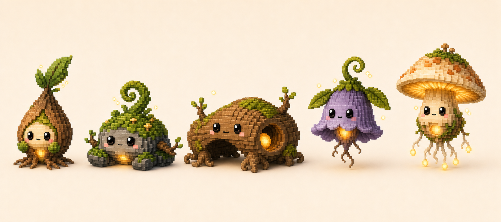
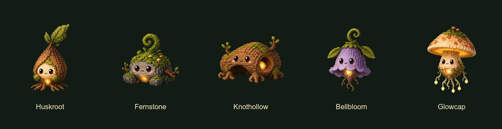

# Mossbound Pet Family Design

**Date:** 2026-07-19

**Status:** Implemented

## Summary

Pets now includes **Mossbound**, a five-pet family of woodland relics awakened by a shared golden life spark. The approved seed-pod, mossy stone/fern, and mushroom-lantern spirits remain the family's visual anchors. Two additions complete the launch silhouette set:

- **Knothollow**, a low, broad fallen-log arch with an ember in its hollow.
- **Bellbloom**, a light, hanging bell-flower relic with a pollen-bright core.

The five-pet roster is large enough to feel like a standalone collection while retaining a disciplined rarity curve: two common, two rare, and one legendary. Every member uses the existing asset-pack path and supports idle, busy, waiting, excited, and sleeping states. Completion and error continue through the existing shared runtime reaction layer rather than requiring family-specific reaction frames.

From left to right: Huskroot, Fernstone, Knothollow, Bellbloom, and Glowcap.

The production roster ships all five pets with complete idle, busy, waiting,
excited, and sleeping packs, plus the shared runtime life-spark effect.

## Current-App Fit

The design is shaped around the current production system rather than a hypothetical pet runtime:

- `PetDefinition` owns rarity, category, capabilities, defaults, presentation, ambient effect, and an asset-backed `PetArtPack`.
- `PetArtPack` supports idle, busy, waiting, excited, sleeping, completion, and error animations, with missing optional states resolving directly to idle.
- The overlay resolves reactions before hover or steady status moods.
- The desktop overlay renders the 132-point sprite at `0.72` scale, producing an approximately 95-point visible pet.
- Collection cards use 78-point sprites, settings previews range from 34 to 116 points, and sidebar rows use 34-point sprites.
- Production art is currently 512x512 RGBA PNG with transparent corners and no baked floor or cast shadow.
- The existing runtime already supplies per-pet motion presets, status transitions, pixelation, grounding shadows, and shared completion/error treatments.

Mossbound therefore needs no new settings surface, persistence model, render-source case, or collection behavior. The only proposed renderer extension is one small deterministic ambient-effect kind for the family's restrained life sparks.

## Goals

- Establish Mossbound as a complete family separate from Cloud Pets and Tesslings.
- Preserve the approved trio's identity and woodland-relic/golden-spark language.
- Ship five silhouettes that remain distinct before color, face, or detail is considered.
- Give all five pets complete steady-state art packs.
- Make each state legible through posture and silhouette, not only expression or glow intensity.
- Keep all external magic restrained enough for a desktop utility.
- Reuse the current catalog, collection, reaction, animation, pixelation, and asset-loading systems.

## Non-Goals

- Production implementation before roster approval.
- Generating or packaging the 125 production state frames in this design pass.
- New completion or error frame directories for launch.
- User-selectable colors, seasonal variants, accessories, or pet evolution.
- A general particle editor, layered-animation authoring system, or new settings controls.
- Animal-shaped woodland pets or ordinary creatures wearing forest props.

## Family Identity

Mossbound are old forest objects that have held enough dawnlight to become companions. Each is a relic first and a character second: husk, stone, log, flower bell, or mushroom lantern. The face and root-like limbs reveal the life inside without turning the object into a costumed animal.

### Shared construction

- Softly beveled voxel construction matching the approved concept and current generated production art.
- Near-isometric three-quarter view with warm upper-left studio light.
- Matte-satin bark, stone, moss, leaf, and mushroom surfaces; glossy square eyes remain the only high-gloss material.
- Large square black eyes, tiny centered mouth, and restrained blush.
- One unmistakable golden-amber life source per pet.
- Moss, roots, stems, or gills that respond to the life source with delayed secondary motion.
- A few small golden square motes, supplied at runtime rather than baked outside the character silhouette.

### Family exclusions

- No cloud, weather, robot, textile, gemstone, orbital, or animal anatomy motifs.
- No interchangeable recolors or repeated body templates.
- No more than one hero plant gesture per pet: shoot, fern, twig buds, bell stem, or cap/gills.
- No detached companion objects that become necessary to identify the pet.
- No broad magical aura, constant sparkle cloud, or bloom that softens the voxel silhouette.

### Core palette

| Role | Target colors | Use |
| --- | --- | --- |
| Bark | umber `#6E4930`, cutwood `#A9784C` | Huskroot, Knothollow, roots, small twigs |
| Moss | olive `#71812A`, lichen `#A3B45A` | Family binder across every pet |
| Stone | granite `#6E716C`, cool shadow `#4F5753` | Fernstone body and grounded contrast |
| Living cream | warm cream `#E7D2AD`, peach `#C98455` | Faces, Glowcap, small shelf growths |
| Bell accent | muted dusk violet `#78698A` | Bellbloom only; kept gray enough to remain woodland material |
| Life light | amber `#FFC64D`, hot center `#FFF0A0`, ember `#F39A2E` | Core, reflected seams, and restrained motes |
| Face | near-black `#151314`, white highlight | High-contrast readability at small sizes |

The golden source is the only magical hue shared at full intensity. Pet-specific accents remain materially motivated and subdued.

## Launch Roster

| Pet | Proposed ID | Rarity | Primary silhouette | Personality | Life-spark placement |
| --- | --- | --- | --- | --- | --- |
| Huskroot | `huskroot` | Common | Tall teardrop husk, leaf shoot, radial root feet | Earnest, brave, always first to sprout | Low belly beneath the face |
| Fernstone | `fernstone` | Common | Wide squat boulder with a single tall fiddlehead curl | Patient, sturdy, quietly helpful | Warm seam at the stone's underside |
| Knothollow | `knothollow` | Rare | Low horizontal log arch with strong negative space | Old-soul storyteller with a dry playful streak | Deep in the side hollow, reflected on inner rings |
| Bellbloom | `bellbloom` | Rare | Hovering inverted bell with scalloped rim and curled stem | Sensitive listener, attentive and musical without sound | Suspended inside the open bell |
| Glowcap | `glowcap` | Legendary | Tall parasol cap over a narrow lantern body and root tassels | Serene guide that feels ancient but welcoming | Belly lantern feeding light into the gills |

The rarity assignments reflect visual and animation complexity, not implied power. Huskroot and Fernstone establish the family clearly with simple grounded forms. Knothollow and Bellbloom introduce more demanding negative space and secondary motion. Glowcap earns legendary status through its large luminous cap, layered gills, floating body, and tassel choreography.

## Pet-Specific Art Direction

### Huskroot

- **Materials:** warm bark husk, fresh olive shoot, cream inner face, compact root bundles.
- **Silhouette guard:** keep the outer husk as one uninterrupted teardrop. The shoot may lean but cannot widen the body into a tree canopy.
- **Face guard:** the cream face window must remain at least one third of the body width and must not be crossed by bark seams.
- **Personality in pose:** slightly forward and eager; leaf hands gather near the core when uncertain.

### Fernstone

- **Materials:** granite body, thick moss blanket, one dark-green fiddlehead, two short twig arms, at most three ochre blooms.
- **Silhouette guard:** the stone mass stays squat and asymmetrical. The single curled fern is the only tall element.
- **Face guard:** eyes sit on an uninterrupted stone plane; moss never drapes between them.
- **Personality in pose:** planted and reassuring; most motion begins in the fern and arrives late in the heavy body.

### Knothollow

- **Materials:** bark shell, visible cutwood rings inside the arch, moss cap, two twig buds, clustered root feet.
- **Silhouette guard:** preserve a large readable hollow beneath the front bridge and a second side opening containing the core. Do not collapse it into a brown boulder.
- **Face guard:** face sits centered on the front bark bridge, separate from the bright core so the core cannot be mistaken for an eye.
- **Personality in pose:** calm and wry; roots do small precise work while the log itself moves with weight.

### Bellbloom

- **Materials:** muted violet petals, green stem and leaf fins, small bark-brown root tassels, amber pollen core.
- **Silhouette guard:** the body tapers clearly from broad scalloped bell rim to a narrow hanging point. The stem curl is smaller than Fernstone's fern curl.
- **Face guard:** eyes remain above the brightest opening and sit on a simple front petal plane.
- **Personality in pose:** highly attentive; responds to events with petal and stem gestures rather than large translation.

### Glowcap

- **Materials:** cream mushroom flesh, apricot cap patches, moss wrap, luminous gills, four grouped root-tassel bundles.
- **Silhouette guard:** the cap must remain a broad parasol and the body must remain narrow enough to distinguish it from Bellbloom's continuous bell.
- **Face guard:** the face occupies a clean stem area with no bright gill rays behind the eyes.
- **Personality in pose:** gentle and ceremonial; light travels through the gills before the body reacts.

## Family Animation Grammar

Mossbound motion follows **kindle, grow, settle**:

1. The amber core changes first, signaling intent.
2. The main relic body responds with a small, weight-appropriate pose change.
3. Moss, leaves, roots, gills, or tassels arrive a fraction later as secondary motion.
4. The pet returns to its canonical silhouette before the loop closes.

This makes the family feel alive without borrowing the Tesslings' reassembly grammar. Mossbound do not split into parts, orbit, or radically transform. Their growth is elastic but restrained, their heavy materials retain weight, and their golden energy travels through an existing seam or cavity.

### State meaning

- **Idle:** slow inner light, one characteristic micro-gesture, long holds, and a short blink.
- **Busy:** purposeful repeated work with a brighter steady core; never frantic locomotion.
- **Waiting:** body leans or opens toward the user, then holds; this is attentive anticipation, not sadness.
- **Excited:** one readable anticipation, one silhouette-expanding apex, a brief spark accent, then recovery.
- **Sleeping:** extremities fold inward, the core becomes an ember, and the pet settles lower or closes around itself.

## Per-Pet State Matrix

| State | Huskroot | Fernstone | Knothollow | Bellbloom | Glowcap |
| --- | --- | --- | --- | --- | --- |
| Idle | Core warms; shoot unfurls a few degrees; roots press and release; quick blink | Core glows under the stone; fiddlehead slowly opens then recoils; twig tips lag behind; blink | Light travels once around the inner ring; one bud lifts; front roots flex under the bridge; blink | Bell sways a few degrees; petal rim opens and closes; one pollen mote rises; blink | Belly lantern brightens; light ripples through gills; cap lifts slightly; tassels settle in sequence; blink |
| Busy | Shoot angles forward; alternating root tips tap in place; core holds bright | Fern works like a slow metronome; twig arms tend left then right; stone rocks by only a few pixels | Inner light scans left to right; roots make alternating precise taps; twig buds tick in counterpoint | Bell rings visually side to side without sound; leaf fins counterbalance; core holds bright | A chasing light crosses the gills; tassel groups alternate; cap stays level like a work lamp |
| Waiting | Husk seam parts slightly; leaf hands cup forward; body leans and holds | Body lowers; fern arches forward like a question mark; arms extend, then freeze | Arch rises just enough to enlarge its opening; roots brace; the side core pulses twice slowly | Sway stops at center; petals open downward; stem curl leans forward; core gives two soft pulses | Pet descends slightly; cap tips toward the user; front tassels point down and hold; gills stay warm |
| Excited | Shoot springs tall; leaf fan opens; body makes one small hop; two or three sparks pop | Fern briefly unfurls; stone lifts and lands with weight; blooms and twig tips bounce once | Log compresses into its roots, rebounds, and reveals a brighter ring; both buds open; one warm spark escapes the hollow | Stem coils then releases; scalloped petals flare wide; body rises a few pixels; pollen sparks fan upward | Cap pops upward; all gills flare from center outward; tassels fan, then spiral back under the body |
| Sleeping | Shoot droops; husk sides close around the face; roots curl toward the ember | Fern coils flat over the moss like a blanket; arms tuck; body settles; underside becomes a dim ember | Roots fold beneath the bridge; buds close; arch lowers; hollow aperture narrows and light fades to one coal | Petals close into a soft bud; leaf fins fold; pet hangs lower and sways only with breathing | Cap lowers like a parasol; gills dim in a slow ring; tassels curl into four compact bundles; belly light becomes a pinprick |

## Frame and Timing Recommendations

Every state loops. The production target is 25 frames per pet and 125 Mossbound frames total.

| State | Frames | Recommended durations in seconds | Recommended blends | Motion preset | Loop character |
| --- | ---: | --- | --- | --- | --- |
| Idle | 8 | `1.70, 0.48, 0.42, 0.48, 1.10, 0.10, 0.12, 0.10` | `0.18, 0.14, 0.14, 0.14, 0.10, 0.04, 0.04, 0.04` | `.breathe` | 4.50 seconds; long neutral hold, growth beat, second hold, three-frame blink/recovery |
| Busy | 4 | `0.24, 0.24, 0.24, 0.24` | `0.08` each | `.bob` | 0.96 seconds; clear alternating work cycle |
| Waiting | 4 | `0.70, 0.52, 0.52, 0.70` | `0.14` each | `.sway` | 2.44 seconds; lean/open, attentive hold, return |
| Excited | 5 | `0.16, 0.14, 0.14, 0.16, 0.30` | `0.05, 0.05, 0.05, 0.05, 0.08` | `.pulse` | 0.90 seconds; anticipation, apex, secondary follow-through, recovery |
| Sleeping | 4 | `1.40, 0.80, 0.80, 1.40` | `0.18` each | `.breathe` | 4.40 seconds; closed resting pose with two gentle breath extremes |

These timings deliberately sit near the released Tessling contract so they fit the same renderer and performance assumptions, but Mossbound use longer holds and less geometric displacement. Frame timing should be shared by a family helper unless final art reveals a specific clipping or ghosting problem.

The core light must not jump between crossfaded frames. It should change position only when light is explicitly traveling along a continuous ring, gill, seam, or cavity. Thin roots and leaves should move less than one local voxel width between adjacent frames whenever a blend exceeds 0.08 seconds.

## Completion and Error Compatibility

Mossbound should launch with `completion` and `error` art set to `nil` in each `PetArtPack`.

- The current resolver requests the reaction state first.
- The art pack falls directly back to the pet's idle animation.
- The shared completion modifier adds its amber/coral/pink masked treatment, warm shadow, pulse, and lift.
- The shared error modifier reduces saturation and brightness, adds a cool charcoal tint, and settles the pet downward.

This is compatible with the family because each idle silhouette is neutral, centered, and complete. The internal amber core remains visible under completion and becomes a subdued coal under error. Every pet must also pass a grayscale review: the error treatment cannot erase the face, merge a limb into the body, or make the silhouette depend on green-versus-brown contrast.

No completion-only spark burst is proposed for launch. Completion already has a four-second runtime treatment, and layering a second celebration grammar would become noisy. Error freezes the ambient loop under the current motion gate; completion allows it to continue.

## Restrained Ambient Effect

Add one deterministic `PetAmbientEffectKind.lifeSparks` value for Mossbound. All five definitions use the same effect so it reads as family atmosphere rather than rarity decoration.

- Three seeded square motes total; only one or two should be clearly visible at once.
- A 5.6-second rise-and-fade cycle with staggered phase offsets.
- Motes remain within roughly 28 logical units of the body and never cross the face.
- Render size is approximately 1.8 to 3 logical units with warm amber fill and a very small soft edge.
- Peak opacity stays at or below `0.72`; no broad halo and no lightning-style flash.
- Motes rise no more than 18 logical units and drift no more than 5 units horizontally.
- At 34-point sidebar size the motes may disappear naturally; identification cannot depend on them.
- Turning Idle Motion off freezes a canonical sample, matching existing snow, rain, and wind behavior.
- External motes remain runtime geometry. Production PNGs contain the internal core and its reflection, but no detached spark field or baked cast shadow.

## Small-Surface Readability

Art review must include the actual production surfaces, not only 512-pixel source images.

### Readability hierarchy

1. **Silhouette:** identifiable at 34 points as teardrop, boulder, arch, bell, or parasol.
2. **Face:** eyes and mouth readable at the approximately 95-point overlay and 78-point collection card; eyes remain distinguishable at 34 points.
3. **Life source:** visible at 78 and 95 points, but not required at 34 points.
4. **Material detail:** moss, buds, blooms, ring grain, and tiny motes may simplify or disappear at 34 points.

### Source-art constraints

- Use a 512x512 transparent canvas with substantive bounds kept inside `28...488` on both axes.
- Keep the face on a clean plane; each eye should be at least 20 source pixels in its shortest dimension.
- Keep the essential core aperture at least 24 source pixels across.
- Essential silhouette features should be at least 16 source pixels thick; thinner roots must be grouped into visible bundles.
- Keep at least 20 source pixels between separate critical features such as Knothollow's eyes and side core.
- Preserve a minimum 28-pixel safe margin around the excited-state maximum envelope.
- Center substantive bounds within 12 pixels of the canonical idle center for persistent states.
- Allow no more than 10 percent width or height drift from the canonical state except at the excited apex, which may reach 14 percent while remaining inside the safe canvas.
- Test every canonical pose at 95, 78, 42, and 34 points on both light and dark backgrounds, with smooth and Chunky Pixels rendering.
- Review solid-black silhouettes and grayscale renders. If a pet cannot be named without its palette, revise the form rather than adding more detail.

### Per-pet risk checks

- Huskroot's shoot must not vanish into the husk tip.
- Fernstone's fern curl must remain separate from its moss cap.
- Knothollow's negative-space arch must not fill in after downsampling or pixelation.
- Bellbloom's scalloped rim must not merge with the amber core into a single bright blob.
- Glowcap's face must remain readable beneath the bright gills, and its tassels must read as four groups rather than visual noise.

## Catalog and Presentation Contract for Later Implementation

Mossbound should enter after Tesslings as category order `2` with category ID `mossbound` and display name `Mossbound`.

All five definitions should use:

- `.assetPack` rendering.
- `.chunky` maximum pixelation.
- Status moods enabled.
- Hover excitement enabled.
- `.standard` instance defaults.
- `.lifeSparks` ambient effect.
- A `0.16`-second state transition.

Initial presentation targets, to be tuned against canonical transparent art:

| Pet | Content scale | Anchor X | Anchor Y | Shadow width x height | Shadow opacity |
| --- | ---: | ---: | ---: | --- | ---: |
| Huskroot | `0.93` | `0` | `1` | `64 x 11` | `0.16` |
| Fernstone | `0.90` | `0` | `3` | `92 x 13` | `0.17` |
| Knothollow | `0.86` | `0` | `4` | `104 x 12` | `0.16` |
| Bellbloom | `0.91` | `0` | `-1` | `54 x 8` | `0.12` |
| Glowcap | `0.88` | `0` | `-1` | `66 x 9` | `0.13` |

The IDs are additive raw values, so the current `PetInstance` persistence path requires no schema migration. Unknown IDs continue following the current catalog fallback. A later implementation should place the five concrete definitions and their shared animation helper in `Sources/PetsCore/Pets/Definitions/MossboundPetDefinitions.swift` and resources under `Sources/PetsCore/Resources/PetArt/<pet-id>/<state>/`.

## Production Art Workflow

After roster approval:

1. Produce one transparent canonical idle frame for each pet from the approved family sheet.
2. Validate silhouette, face, core placement, camera, voxel scale, and small-surface readability before generating any state sheet.
3. Use each accepted canonical frame as the identity anchor for one contact sheet per state.
4. Normalize accepted frames to 512x512 RGBA without changing relative scale or anchor.
5. Keep backgrounds, floor shadows, external glow, text, and ambient motes out of production PNGs.
6. Validate frame counts, alpha, transparent corners, bounds, component spacing, and anchor stability.
7. Build per-state and full-family contact sheets from final normalized assets.
8. Only then register definitions, category membership, resources, and `.lifeSparks` in code.

The generated concept sheet is an art-direction reference, not production artwork. Its cream background, cast shadows, and soft external glow must not be copied into state frames.

## Verification Requirements for Later Implementation

Automated checks should prove:

- Mossbound follows Tesslings in category order and contains exactly the five approved IDs.
- Rarity distribution is two common, two rare, and one legendary.
- Every pet owns exactly 8 idle, 4 busy, 4 waiting, 5 excited, and 4 sleeping frames.
- Every referenced image is 512x512 RGBA with transparent corners.
- Every persistent state stays within the approved bounds and alignment tolerances.
- All five definitions support moods, hover excitement, Chunky Pixels, and `.lifeSparks`.
- Completion and error remain absent from the art packs and resolve to idle before the runtime reaction modifier.
- Life-spark sampling is deterministic, bounded, staggered, and frozen when motion is disabled.

Manual review should cover:

- Light and dark desktop backgrounds.
- Overlay, collection card, settings preview, unlock sheet, and 34-point sidebar row.
- Smooth, Subtle Pixels, Medium Pixels, and Chunky Pixels modes.
- Normal, busy, waiting, hover excitement, sleeping, completion, and error.
- Multiple Mossbound with independent phase offsets and no distracting synchronized spark field.
- Silhouette recognition without color and face recognition under grayscale error treatment.

The later repository gate remains focused catalog/resource/animation tests, then `./scripts/check.sh`, followed by `./scripts/run_app.sh --verify` and visual inspection of the rebuilt app bundle.

## Approved Decision

The five-pet launch roster—**Huskroot, Fernstone, Knothollow, Bellbloom, and Glowcap**—and its animation direction were approved on 2026-07-19. Production state frames and implementation remain a separate follow-up phase.
