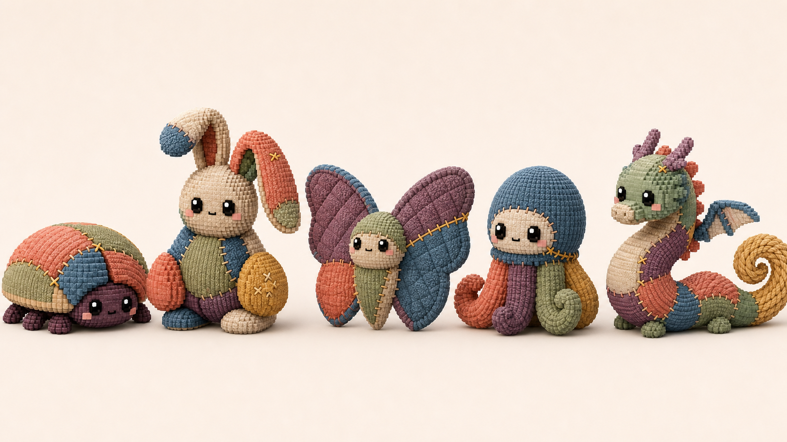
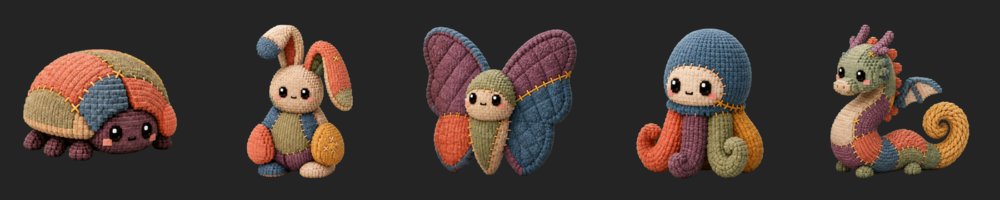
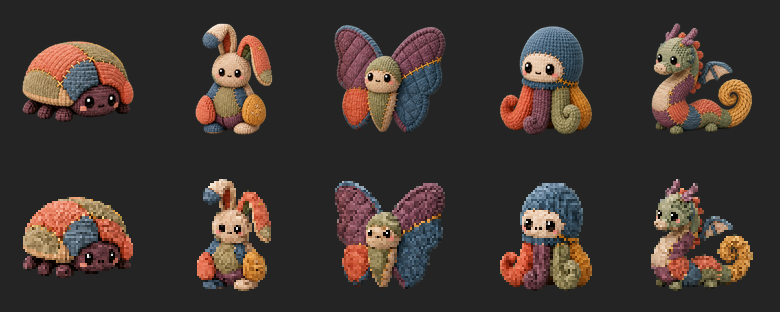
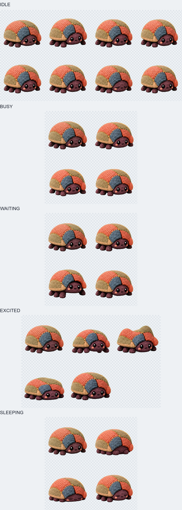
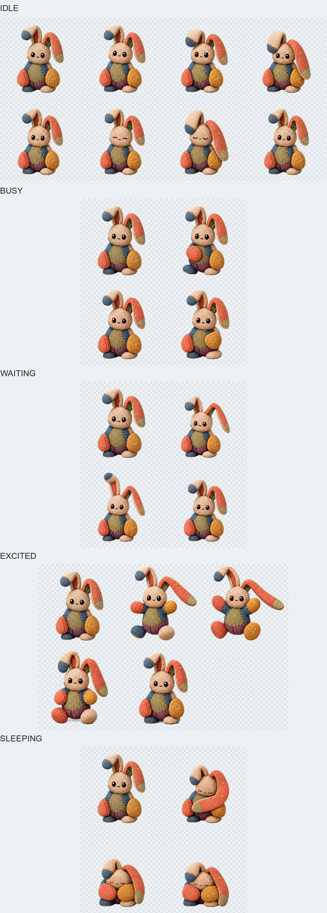
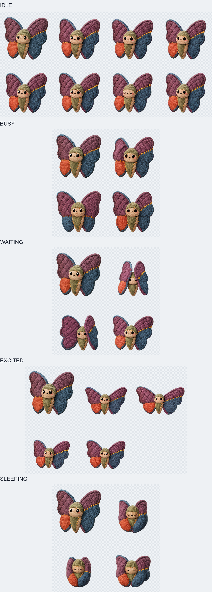
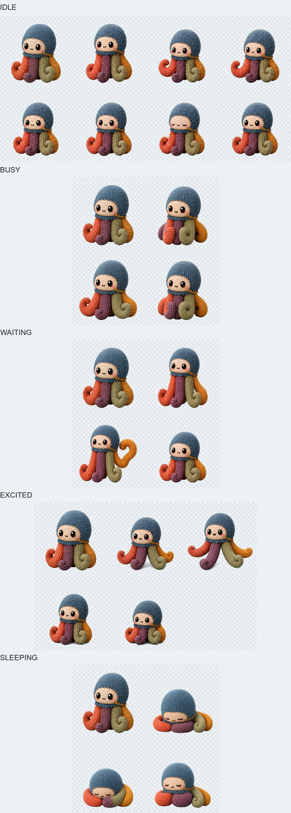
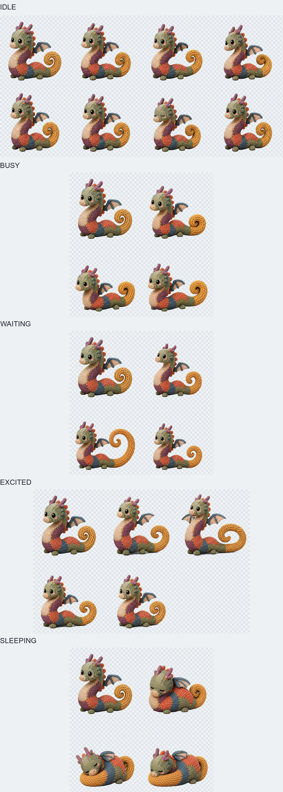
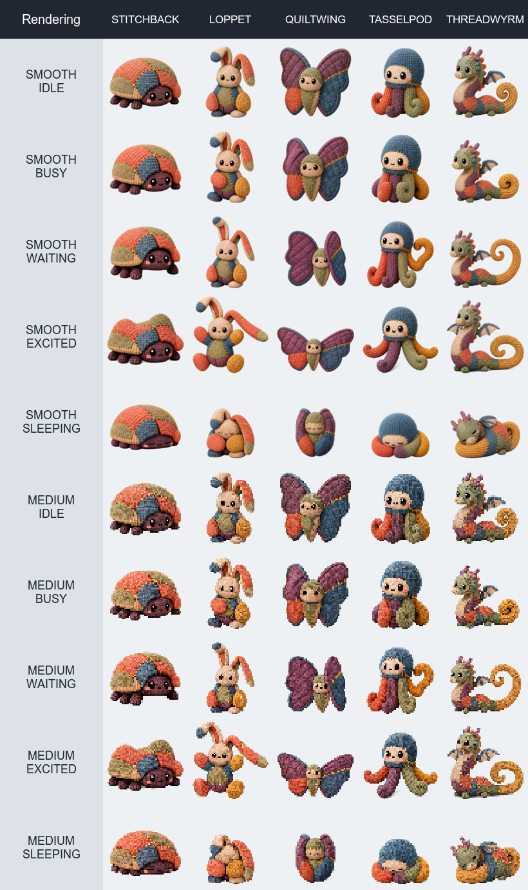

# Patchlings Pet Family Design

**Date:** 2026-07-19

**Status:** Approved and implemented

## Summary

Pets will add **Patchlings**, a five-pet family of handmade voxel-fabric creatures whose visible repairs are part of their identity. The approved starting trio expands with two new body plans so the launch roster is as substantial as Cloud Pets without filling the category with weaker silhouette variants.

The approved launch roster is:

- **Stitchback**, the low patchwork beetle plush from the approved concept.
- **Loppet**, the tall floppy-eared rabbit plush from the approved concept.
- **Quiltwing**, a broad moth plush with blanket-stitched wings.
- **Tasselpod**, a top-heavy octopus plush with four thick looped arms.
- **Threadwyrm**, the curled thread-dragon plush from the approved concept.

The family shares matte voxel-fabric construction, oversized glossy eyes, a tiny stitched mouth, faded textile colors, deliberate asymmetry, and mustard-gold repair stitches. It does not share one repeated body primitive. Every member must remain identifiable from its outer contour at the 132-point desktop overlay size.



## Goals

- Add a standalone `Patchlings` category after Tesslings.
- Launch with five pets rather than the approved concept's three.
- Preserve the approved beetle, rabbit, and thread-dragon identities.
- Add two genuinely different silhouettes rather than more upright plush animals.
- Give every pet a complete idle, busy, waiting, excited, and sleeping state pack.
- Make fabric compression, folds, and repair-seam tension the family's animation grammar.
- Preserve completion and error compatibility through the existing runtime reactions.
- Keep every defining feature legible at 132 points and through Medium Pixels.
- Define an art contract strong enough to generate and validate production frames later.

## Non-Goals

- Production code changes in this design pass.
- Production animation-frame generation before roster approval.
- User-selectable colors, materials, patches, or stitches.
- Patchling-specific completion or error frame directories at launch.
- Loose-thread particles, fabric lint, sparkles, or a new ambient-effect runtime.
- Clothing, handheld props, exposed stuffing, needles, scissors, or safety-pin motifs.
- A sixth launch pet added only to increase the count.

## Why Five

Five gives Patchlings parity with the current Cloud Pets category and supports a clean two-common, two-rare, one-legendary progression. More importantly, the five proposed contours cover the useful silhouette space without obvious duplication:

1. Low dome: Stitchback.
2. Tall column: Loppet.
3. Broad kite: Quiltwing.
4. Top-heavy bell: Tasselpod.
5. Long curl: Threadwyrm.

A sixth member should be reserved for a later addition with a new material or motion idea. A second quadruped, another long-tailed creature, or another broad winged plush would weaken the launch lineup.

## Family Identity

Patchlings are cherished fabric creatures that have been repaired many times. Their repairs are neither damage effects nor magical armor. Each stitch records care, and movement gently reveals how differently weighted fabrics pull against those repairs.

### Shared construction

- Rounded, softly stepped macro-voxels rather than hard cubic blocks.
- A near-isometric three-quarter camera matching the shipped Cloud and Tessling art.
- A matte textile finish with restrained woven or ribbed direction.
- Large glossy black square eyes with one white highlight per eye.
- A tiny dark stitched mouth and small felt blush patches.
- Three to five large fabric regions per pet; never confetti-sized patchwork.
- One dominant mustard-gold repair and at most two supporting repair details.
- At least one deliberate asymmetry in patch layout, ear/wing/limb posture, or seam path.
- Runtime grounding shadows only; no baked floor, cast shadow, or halo.

### Family palette

The approved concept establishes the base palette:

| Role | Color direction | Purpose |
| --- | --- | --- |
| Neutral | oat, unbleached linen, warm cream | face panels, bellies, quiet negative space |
| Warm | faded coral, dusty salmon | friendly dominant patches |
| Cool | washed denim, slate blue | structural counterweight |
| Green | muted sage, olive cloth | natural worn textile note |
| Dark | aubergine, mulberry | feet, undersides, contrast anchors |
| Repair | mustard, antique gold thread | seams and stress-point crosses only |

Colors remain soft, but adjacent major panels must differ in both hue and value. The family must still read under the current error reaction's desaturation and dark blue color multiply.

### Material hierarchy

Each pet may mix two or three of these surfaces:

- Rib knit for long flexible volumes.
- Short-pile corduroy for load-bearing shells and wings.
- Woven linen for face and belly panels.
- Velour or chenille for rounded hands, feet, and tentacle ends.
- Braided cord only for Threadwyrm's tail and Tasselpod's thick arm loops.

Materials should be suggested by broad rib direction and soft highlights. Individual fibers, frayed fuzz, and dense microtexture will shimmer during crossfades and disappear under pixelation.

## Roster and Progression

| Pet | Proposed ID | Rarity | Silhouette | Personality | Hero repair |
| --- | --- | --- | --- | --- | --- |
| Stitchback | `stitchback` | Common | Low 1.6:1 beetle dome with six stub feet | Steady, brave, quietly industrious | Gold seam crossing two shell plates |
| Loppet | `loppet` | Common | Tall seated bean with one high ear and one long side-droop | Attentive, tender, a little overeager | Cross-stitch cluster at the loaded paw and ear root |
| Quiltwing | `quiltwing` | Rare | Broad diamond with two scalloped wings and a small central body | Shy, exacting, watchful | Long blanket-stitch repair across one wing |
| Tasselpod | `tasselpod` | Rare | Round head over four thick looped arms; bell-shaped outer contour | Calm, capable, playful when unobserved | Curved gold seam binding the head to one arm root |
| Threadwyrm | `threadwyrm` | Legendary | Long S-curve with small wings and a large spiral cord tail | Patient, ancient, gently theatrical | Gold ladder-stitch running along the chest and tail join |

### Stitchback

The shell stays low and wide, with overlapping coral, sage, and denim panels. A dark aubergine face peeks from beneath the front shell edge, supported by six chunky feet. The face must remain bright enough to read under the overhang.

- **Materials:** short corduroy shell, linen underside, chenille feet.
- **Palette:** coral and sage dominant; denim side plate; aubergine face and feet; oat underside.
- **Do not:** add antennae, wings, mandibles, or tiny shell spots. The shell/face/feet contour is already sufficient.

### Loppet

The approved asymmetrical ears are the defining feature: one rises and folds over near the top, while the other falls well to the side. The body is a compact seated bean with oversized mismatched paws, not a long-limbed rabbit.

- **Materials:** rib-knit ears and torso, woven belly, chenille paws and feet.
- **Palette:** oat dominant; denim torso panel; sage belly; coral and mustard paws; aubergine seat.
- **Do not:** straighten both ears, make the paws symmetrical, or let the body become humanoid.

### Quiltwing

Quiltwing adds the missing broad, airborne silhouette. Two thick scalloped moth wings form a shallow diamond around a small plush body. The wings are quilt panels, not thin insect membranes, and remain slightly folded toward the viewer so they have visible thickness.

- **Materials:** corduroy and woven quilt wings, velour body, felt face panel.
- **Palette:** dusty plum and denim wings; oat body; sage and coral repair panels; mustard stitch line.
- **Do not:** add detached dust, delicate antenna hairs, transparent wings, or more than three scallops per wing.

### Tasselpod

Tasselpod adds an inverted, hanging silhouette. A round top-heavy head settles over four thick arms. Two arms support the body, one curls visibly at the side, and one trails just far enough to break symmetry. The limbs read as stuffed loops rather than rope strands.

- **Materials:** soft velour head, woven face panel, thick braided-cloth arms with chenille ends.
- **Palette:** washed denim head; oat face; coral, aubergine, and sage arms; mustard seam.
- **Do not:** exceed four visible arms, use narrow dangling threads, or create a generic round blob when the arms close.

### Threadwyrm

The approved dragon keeps its tall head, small horns, patchwork chest, tiny wings, low body, and large spiral cord tail. The tail is a continuous stuffed braid that completes the silhouette; it must not look like a detached particle or a second creature.

- **Materials:** rib-knit head and torso, woven belly, corduroy wings, braided tail.
- **Palette:** sage dominant; aubergine chest; coral and denim body patches; oat belly; mustard tail and repairs.
- **Do not:** enlarge the wings into a second broad-wing silhouette, add fire, or let the tail become a thin line.

## Animation Language

Patchlings move through **compression, fold, lag, and repair tension**.

- Soft volumes squash before they move and settle one beat after the main body.
- Heavy panels lead; ears, wing tips, feet, arm loops, and the braided tail lag behind.
- Repair seams stretch by a few pixels at motion peaks, then reseat cleanly.
- Mustard stitches may catch one restrained highlight at an effort peak, but never glow continuously.
- Body parts never detach, orbit, reconfigure, or pass through one another. That behavior belongs to Tesslings.
- No frame invents a new patch, stitch, limb, or material. Animation changes posture, not construction.
- Every persistent loop returns to the exact canonical silhouette and anchor before wrapping.

### Shared state cadence

All five persistent states loop because busy, waiting, hover excitement, and sleep may remain active for an indefinite period.

| State | Frames | Recommended durations | Recommended blends | Default motion | Purpose |
| --- | ---: | --- | --- | --- | --- |
| Idle | 8 | `1.70, .55, .50, .55, 1.35, .15, .15, .15` s | `.18, .16, .16, .16, .14, .05, .05, .05` s | `.breathe` or species-specific `.sway` | Slow fabric breath, one signature adjustment, quick blink |
| Busy | 4 | `.26, .26, .26, .26` s | `.08` s each | `.bob` | Repeating work effort with a stable face and anchor |
| Waiting | 4 | `.78, .54, .54, .78` s | `.16` s each | `.sway` | Attentive lean or listening gesture with a longer hold |
| Excited | 5 | `.18, .16, .18, .20, .34` s | `.06, .06, .06, .06, .08` s | `.pulse` | One readable release-and-settle gesture, then clean loop |
| Sleeping | 4 | `1.35, .75, .75, 1.35` s | `.18` s each | `.breathe` | Compact resting posture with slow weight transfer |

The idle loop totals 5.10 seconds. Individual pets may vary a complete state's durations by at most 15 percent to express weight, but every frame count and filename remains uniform. Quick eye transitions stay near 0.15 seconds so crossfading does not leave half-lidded faces hanging.

## Per-Pet State Matrix

| Pet | Idle | Busy | Waiting | Excited | Sleeping |
| --- | --- | --- | --- | --- | --- |
| Stitchback | Shell rises one voxel step, front feet resettle, gold shell seam tightens, blink | Six feet march in two alternating groups while the shell leans forward; use 10% slower cadence | Rocks onto rear feet and lifts the shell lip so the face peeks farther out | One compact hop; shell plates lift in sequence and close from rear to front | Feet retract, face tucks under the shell lip, dome settles with closed stitch-eyes |
| Loppet | Belly breathes; high ear bows while the side ear drags a beat behind; blink | Paws alternate two soft kneads against the belly while both ears pin slightly backward | High ear turns toward the unseen session; long ear lifts halfway, listens, then droops | One vertical hop with paws up; ears lag, overshoot, and settle; use 10% faster cadence | Both ears fold inward as a blanket; head dips between paws without shrinking the body excessively |
| Quiltwing | Wing tips rise in opposition and the repaired wing gives one tiny quilted ripple; use `.sway` | Wings make shallow alternating fold beats while the head remains locked on target; use 10% faster cadence | Wings close to a tent, then the repaired tip opens alone as if checking for a response | Wings open to their widest safe diamond, body lifts once, then scallops settle from root to tip | Wings wrap into a broad cocoon with the face still visible between their lower edges |
| Tasselpod | Head floats up as the supporting arms compress; side loop curls and uncurls; use `.bob` | Four arms alternate in two pairs as if pulling a seam taut; head stays centered | Supporting arms lengthen slightly, raising the face; side loop forms a clear question-mark curl | Head squashes and rebounds while arms open into a four-lobed star, then roll back underneath | Head sinks into two arms used as a cushion; the other two close the bell silhouette around it; use 10% slower cadence |
| Threadwyrm | A soft body wave travels from chest to spiral tail; wing tips and tail finish late; use `.sway` | Head lowers in focus, wings tuck, and one controlled wave travels down the body; use 15% slower cadence | Head rises, one horn tilts, and the tail spiral opens a quarter turn before listening stillness | Chest lifts, small wings flare, and the spiral tail releases one full outer loop before rewinding | Body coils tighter and the head rests on the inner tail curve; wings close flat; use 10% slower cadence |

### State readability rules

- **Idle** must be calm enough to coexist with desktop work and cannot resemble waiting.
- **Busy** must use a repeatable limb or panel action, not merely faster whole-body bobbing.
- **Waiting** must hold an attentive pose for at least 0.5 seconds.
- **Excited** must produce the largest silhouette change but remain inside the safe canvas.
- **Sleeping** uses closed stitched eyes and a clearly lower center of mass. It cannot be only an eye swap.

## Completion and Error Compatibility

Patchlings should ship with `completion` and `error` animations unset. `PetArtPack.resolvedAnimation(for:)` will therefore use the required idle animation, and the shared runtime treatment will supply the reaction:

- **Completion:** warm amber/coral/pink mask, glow, and gentle lift/pulse.
- **Error:** desaturation, cool charcoal-blue tint, dark shadow, and downward settle.

The canonical idle frame must remain expressive under both treatments:

- Eyes and mouth rely on value contrast rather than color.
- Gold repairs are backed by a darker seam edge so error desaturation does not erase them.
- Coral and mustard panels do not touch without a darker or neutral border, because the completion gradient brings their hues closer together.
- No pet depends on blush alone for its face.

### Implementation compatibility guard

The intended reaction behavior in the existing design is to freeze authored fallback playback and whole-pet ambient motion while the runtime reaction owns movement. The current SwiftUI fallback path only disables ambient motion for error; completion can continue the idle loop and then receive the reaction pulse. Before implementation, the Patchlings pass should either restore the intended freeze for both reactions or explicitly validate and accept that stacked completion motion. The design recommendation is to freeze on `frame-000` for both reactions.

## Ambient Effects

All Patchlings use `PetAmbientEffectKind.none` at launch.

The family may include restrained **authored seam highlights** inside body frames:

- One brief value lift on the hero repair during an effort or excited peak.
- No hue-cycling, emission halo, sparks, lint, dust, thread motes, or detached glints.
- The highlight remains inside the character alpha and cannot change substantive bounds.

This keeps the handmade language readable without competing with Cloud weather or requiring a Patchling-specific runtime sampler.

## Small-Overlay Readability

The live desktop sprite frame is 132 by 132 points. Medium Pixels reduces that to roughly a 60 by 60 raster before nearest-neighbor enlargement, so a source feature needs meaningful area rather than merely existing in the 512-pixel file.

### Required source-art scale

- Production frames are 512x512 RGBA PNGs.
- The dominant silhouette fills 64 to 88 percent of the canvas dimension it uses most.
- Substantive alpha stays at least 24 pixels from every edge.
- Eyes are at least 24x30 source pixels with distinct white highlights.
- The mouth is at least 16 source pixels wide and two effective pixels thick at Medium Pixels.
- Major fabric patches are at least 48 pixels across in their narrow dimension.
- Repair seams are 14 to 18 source pixels thick.
- Hero cross-stitches occupy at least 26x26 source pixels.
- Wing tips, feet, ears, arms, horns, and tail cords remain at least 28 source pixels thick at their narrowest important point.

### Frame continuity

- Canonical frame centers stay within 12 pixels across idle, busy, waiting, and sleeping loops.
- Excited frames may reach a 24-pixel center deviation when the outer bounds counterbalance it.
- Non-excited subject width and height remain within 12 percent of the canonical frame.
- Sleeping may contract by up to 18 percent, but the presentation scale remains unchanged.
- The floor or hover baseline changes by no more than 8 pixels inside a state loop.
- No facial feature moves more than 10 pixels relative to the head panel unless the head itself turns.

### Pixelation limit

Patchlings support Smooth, Subtle Pixels, and Medium Pixels. `maximumPixelation` should be `.medium`, not `.chunky`. The family still reads as voxel-fabric at Medium, while Chunky would reduce important stitch and face details to single unstable pixels.

## Production Art Contract

Every accepted frame must:

- Be a 512x512 transparent PNG with fully transparent corners.
- Preserve the canonical camera, light direction, material scale, face, patch map, stitch count, and repair path for that pet.
- Use no background, floor, text, watermark, baked shadow, or glow beyond the body alpha.
- Keep stitch placement attached to the same fabric panels through all deformations.
- Preserve fabric rib direction as the panel bends; ribs cannot slide independently across the volume.
- Keep gold repair stitches physically seated on the seam rather than floating above it.
- Avoid crossfade shimmer from moving microtexture; broad material lighting changes are preferred.
- Preserve the same number of limbs, wing scallops, horns, shell plates, and visible arm loops in every frame.

## Implemented Resource and Model Shape

The implementation uses the existing asset-pack renderer without a new render source.

### Catalog metadata

- `PetCategoryDescriptor.patchlings`: id `patchlings`, display name `Patchlings`, order `2`.
- Five additive `PetID` values: `stitchback`, `loppet`, `quiltwing`, `tasselpod`, and `threadwyrm`.
- `PatchlingPetDefinitions.swift` owns the five definitions and shared animation helpers.
- Every pet supports status moods and hover excitement.
- Every pet uses `.standard` defaults, `.medium` maximum pixelation, `.none` ambient effect, and `.assetPack` rendering.

### Roster order

The category order is:

1. Stitchback.
2. Loppet.
3. Quiltwing.
4. Tasselpod.
5. Threadwyrm.

This moves from grounded and familiar to increasingly unusual silhouettes while keeping rarity progression visible.

### Presentation starting points

These are the implemented presentation starting values:

| Pet | Content scale | Anchor X | Anchor Y | Shadow width | Shadow height | Shadow opacity |
| --- | ---: | ---: | ---: | ---: | ---: | ---: |
| Stitchback | 0.96 | 0 | 2 | 86 | 12 | 0.18 |
| Loppet | 0.88 | 0 | 3 | 68 | 12 | 0.17 |
| Quiltwing | 0.90 | 0 | 0 | 94 | 10 | 0.13 |
| Tasselpod | 0.94 | 0 | 1 | 76 | 12 | 0.16 |
| Threadwyrm | 0.88 | 0 | 0 | 96 | 11 | 0.14 |

All use a 0.16-second state transition initially. Final values are set from normalized production alpha bounds and verified in the overlay, collection cards, settings preview, and picker.

### Resource layout per pet

Each pet ships with 25 frames:

```text
Sources/PetsCore/Resources/PetArt/<pet-id>/
├── idle/frame-000.png ... frame-007.png
├── busy/frame-000.png ... frame-003.png
├── waiting/frame-000.png ... frame-003.png
├── excited/frame-000.png ... frame-004.png
└── sleeping/frame-000.png ... frame-003.png
```

The five-pet launch therefore requires 125 production frames after the roster and canonical idle poses are approved.

## Art Generation Workflow

1. Use the approved five-pet family concept as the family identity, palette, material, and silhouette reference.
2. Produce a canonical 512x512 chroma-key idle image for each pet.
3. Normalize and review canonical poses together at 132 points and at Medium Pixels.
4. Generate one fixed-grid contact sheet per pet and state, always using that pet's accepted canonical pose as the identity reference.
5. Split, key, despill, and normalize frames to transparent 512x512 canvases.
6. Validate alpha, face identity, patch and stitch continuity, silhouette bounds, anchor drift, and component counts.
7. Review per-state contact sheets and animated loops before catalog integration.

The approved family concept is the source of truth for all five identities. Production generation may correct framing and alpha needs, but it must not redesign the roster or collapse the silhouette differences established here.

## Candidate Canonical Idle Seeds

**Status:** Approved

The approved canonical idle artwork is stored as transparent 512x512 artwork under `docs/assets/patchlings/`. These files remain outside the production resource bundle while the state animation sheets are produced and reviewed.



The readability sheet shows Smooth rendering on the first row and an approximation of the app's 132-point Medium Pixels raster on the second row.



The candidate files are:

- `docs/assets/patchlings/stitchback-idle.png`
- `docs/assets/patchlings/loppet-idle.png`
- `docs/assets/patchlings/quiltwing-idle.png`
- `docs/assets/patchlings/tasselpod-idle.png`
- `docs/assets/patchlings/threadwyrm-idle.png`

## Animation Production Review

**Status:** Approved and integrated

The strip-first production pass covers all 125 required state frames. Review copies remain under `docs/assets/patchlings/animations/`, and the approved production copies are bundled under `Sources/PetsCore/Resources/PetArt/<pet-id>/`.

Each state was generated as one coherent contact sheet from the approved pet seed, then split, chroma-keyed, despilled, normalized with one state-wide scale and bottom-center anchor, and restored to the exact approved canonical seed at `frame-000`. Generated grid-edge pixels were removed from each isolated cell before the final bounds pass.

The five review sheets use the same state order: idle, busy, waiting, excited, sleeping.











The compact readability sheet samples the most informative pose from each state at the live 132-point presentation size. The top five rows use smooth resampling; the bottom five approximate Medium Pixels by reducing to a 60-pixel raster and enlarging with nearest-neighbor sampling.



Timed 192-pixel review loops are stored at `docs/assets/patchlings/animation-reviews/<pet-id>/<state>.gif`. They use the recommended authored frame durations from this spec; runtime blend interpolation and whole-pet ambient motion are intentionally absent from these GIFs.

## Implementation Status

- Patchlings appear immediately after Tesslings in `PetCatalog.builtInCategories`.
- Five concrete definitions provide the approved rarities, presentation values, Medium Pixels cap, state motions, and per-pet cadence modifiers.
- The generic asset-pack renderer supplies idle, busy, waiting, excited, and sleeping playback from the 125 bundled frames.
- Completion and error remain shared runtime reactions with no Patchling-specific reaction directories.
- Authored playback and family ambient motion freeze on canonical `frame-000` during both shared reactions, while the shared reaction treatment continues to animate.
- Patchlings add no runtime ambient effect; repair highlights stay inside the authored sprite alpha.

## Future Verification

Automated checks should verify:

- Patchlings follow Tesslings in category order.
- The category contains the exact five IDs in the approved order.
- Names, rarities, capabilities, maximum pixelation, and collection eligibility are correct.
- Every definition provides exact 8/4/4/5/4 state frame counts.
- Every referenced frame resolves from `Bundle.module`, is 512x512 RGBA, and has transparent corners.
- Alpha bounds stay inside the safe canvas and within state-specific center and size tolerances.
- Stitchback keeps six substantive feet; Quiltwing keeps two wings; Tasselpod keeps four arms; Threadwyrm's tail remains a substantive connected feature.
- Completion and error remain runtime reactions with no Patchling-specific directories.
- Multiple visible Patchlings receive independent phase offsets.

Manual review should cover:

- All five pets are distinguishable as black silhouettes at 132 points.
- Faces, hero repairs, and major patch boundaries survive Medium Pixels.
- Busy and waiting cannot be confused with idle.
- Sleeping reads from posture before eye state.
- Excited frames do not clip tall ears, broad wings, open arms, or the spiral tail.
- Completion and error treatments preserve faces and repair seams.
- Collection cards, settings previews, picker rows, and the desktop overlay use consistent scale.

## Acceptance Criteria

- The launch roster contains five strong, non-redundant silhouettes.
- The approved beetle, rabbit, and thread-dragon remain recognizable.
- Quiltwing and Tasselpod expand the contour and motion range without introducing a new family language.
- Every pet has a specific idle, busy, waiting, excited, and sleeping action.
- Patch and stitch placement remains continuous through every action.
- The family remains readable at 132 points and through Medium Pixels.
- No runtime ambient effect or custom reaction art is required for launch.
- The next art pass can begin from an approved roster rather than revisiting family fundamentals.
