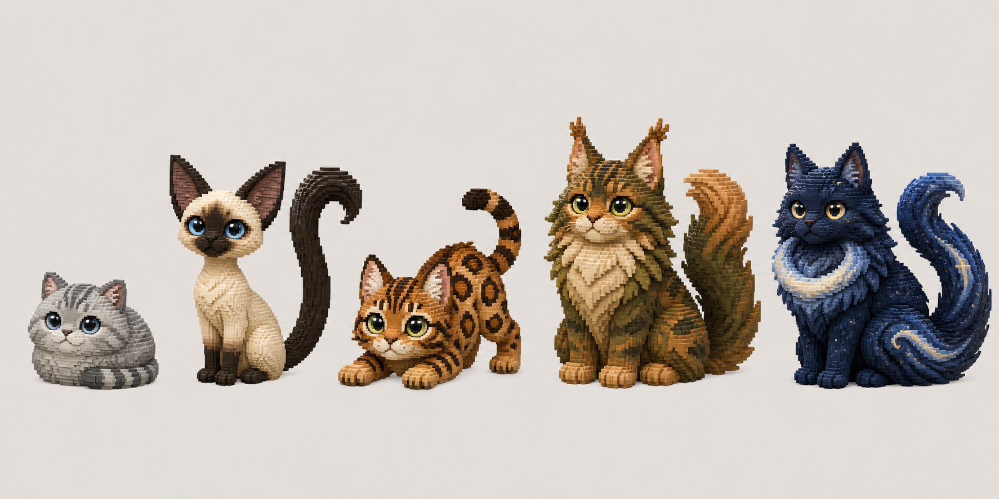
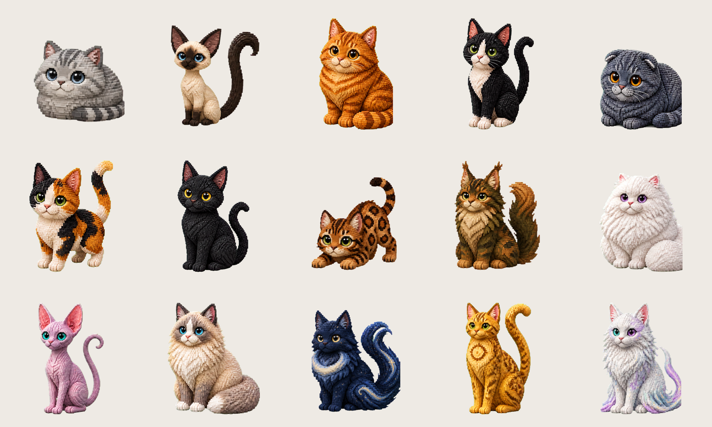
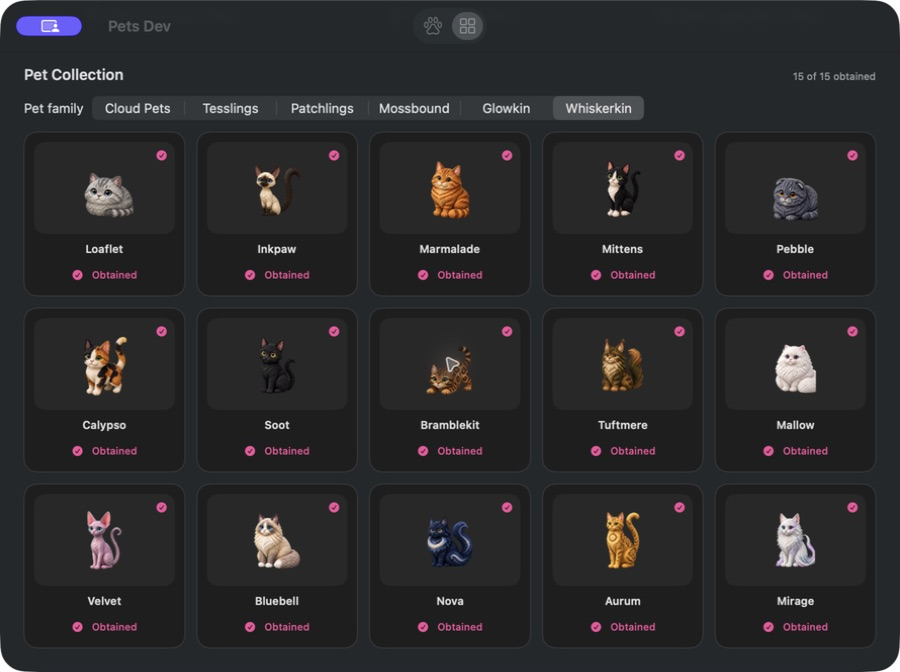
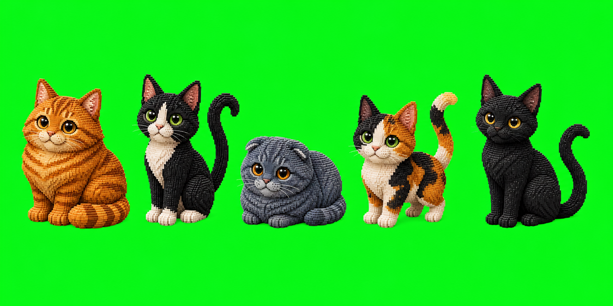
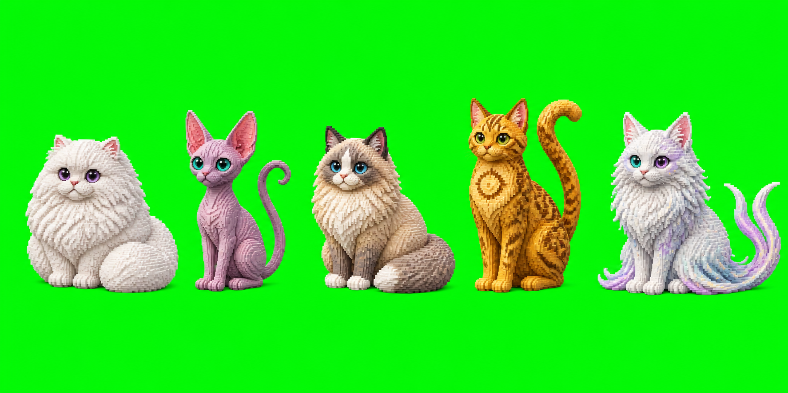

# Whiskerkin Pet Family Design

**Date:** 2026-08-24  
**Status:** Implemented

## Summary

Pets adds **Whiskerkin**, a flagship fifteen-cat family whose members are distinguished by body plan, coat construction, tail language, and movement rather than palette alone. Its expanded seven-common, five-rare, three-legendary curve gives cat fans a much deeper collection than any other family while using the standard asset-backed desktop-pet renderer.

## Roster

| Pet | ID | Rarity | Silhouette | Motion identity |
| --- | --- | --- | --- | --- |
| Loaflet | `loaflet` | Common | Compact round silver loaf | Tiny tail-tip shifts, kneading, compressed hops |
| Inkpaw | `inkpaw` | Common | Slim cream Siamese with one long ink-stroke tail | Upright stretches, paw taps, sweeping tail curves |
| Marmalade | `marmalade` | Common | Plump orange classic tabby with a thick ringed tail | Rounded paw presses, buoyant hops, heavy breathing |
| Mittens | `mittens` | Common | Slender tuxedo with white socks and question-mark tail | Precise paw taps, curious leans, springy jumps |
| Pebble | `pebble` | Common | Low blue-gray fold with plush round body | Compact reaches, tiny rises, tucked-in rests |
| Calypso | `calypso` | Common | Small asymmetric calico with lifted tail | Quick taps, alert lifts, playful pounces |
| Soot | `soot` | Common | Sleek near-black Bombay with long low contour | Quiet stalks, controlled sways, low leaps |
| Bramblekit | `bramblekit` | Rare | Low athletic russet Bengal crouch | Stalking freezes, hindquarter coils, low pounces |
| Tuftmere | `tuftmere` | Rare | Broad moss-and-copper Maine Coon with layered ruff | Weighted paw presses, ruff breathing, plume-tail sweeps |
| Mallow | `mallow` | Rare | Cloud-round white Persian with enormous soft tail | Deliberate paw reaches, soft rises, pillowy sleep |
| Velvet | `velvet` | Rare | Tall rose-lilac Sphynx with large ears and whip tail | Elastic stretches, fine tail curls, weightless hops |
| Bluebell | `bluebell` | Rare | Broad cream Ragdoll with blue points and feather tail | Gentle presses, patient waits, relaxed bounds |
| Nova | `nova` | Legendary | Midnight longhair with pearl crescent ruff and two comet tails | Mirrored tail curls, poised hops, crescent-shaped rests |
| Aurum | `aurum` | Legendary | Tall golden Mau with solar chest marking and hooked tail | Regal holds, sculptural reaches, sun-bright pounces |
| Mirage | `mirage` | Legendary | Opalescent Angora with split-color eyes and fork-tipped ribbon tail | Flowing sways, airy bounds, tail-wrapped rests |

## Family Identity

Whiskerkin share soft premium 3D voxel construction, rounded beveled cubes, tactile fur clumps, glossy readable eyes, tiny mouths, warm studio lighting, and natural cat behavior. Every member remains recognizable at the 132-point overlay size from contour alone.

The family deliberately avoids collars, bells, clothing, props, external particles, and a family-wide ambient effect. Coat detail and cat movement stay inside the sprite artwork so completion and error can continue using the shared runtime reactions.

## Animation Contract

Each pet ships with the established 25-frame state pack. The original five use fully authored state sheets; the ten-cat expansion locks one identity-consistent authored pose per state and derives restrained breathing, tapping, alert, hop, and sleep in-betweens from those accepted poses.

| State | Frames | Whiskerkin behavior |
| --- | ---: | --- |
| Idle | 8 | Breathing, ear or tail motion, restrained blink |
| Busy | 4 | Paw-driven focused action with breed-specific weight |
| Waiting | 4 | Ears forward, alert posture, attentive tail response |
| Excited | 5 | One compact celebratory hop or pounce |
| Sleeping | 4 | Eyes closed, slow breathing, tail-wrapped rest |

All frames are transparent 512×512 RGBA PNGs. Production silhouettes retain at least 28 pixels of canvas safety margin and use `PetArtPack` with completion and error left unset.

## Generation Spec

- **Use case:** `stylized-concept`
- **Asset type:** macOS desktop-pet character roster and animation contact sheets
- **Style:** premium 3D voxel/chibi cats with small rounded cubes and restrained matte-satin fur
- **Composition:** fixed front three-quarter camera, consistent scale and lighting, full silhouettes with tail padding
- **Production background:** `#00ff00` chroma key removed into alpha after sheet slicing
- **Constraints:** natural cat anatomy; stable coat, eye, tail-count, and body-plan identity; no text, props, accessories, shadows, scenery, or watermark

## Implementation

- `PetCategoryDescriptor.whiskerkin` is category order `5`.
- `WhiskerkinPetDefinitions.swift` owns all fifteen definitions and the shared animation helper.
- Production resources live under `Sources/PetsCore/Resources/PetArt/<pet-id>/<state>/`.
- Whiskerkin catalog order groups seven common, five rare, and three legendary cats.
- Catalog, rarity, category, resource-completeness, alpha-envelope, and packaged-resource checks include the complete fifteen-cat family.
